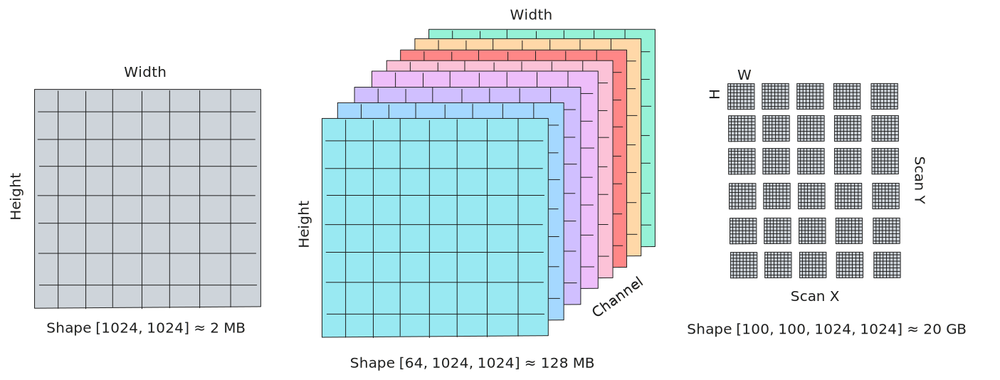
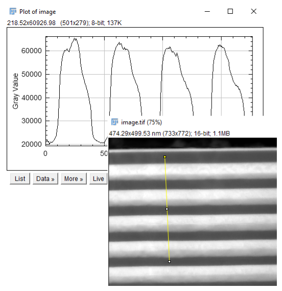
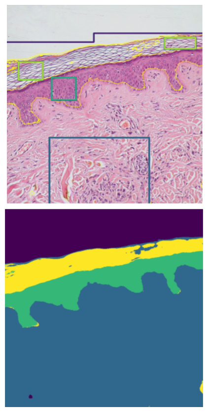

<!--<!-- _footer: `This version is static, all interactive slides are converted to images` -->-->
<a name='start'></a>


# **What is an image?**

Matthew Bryan
*CEA-Leti, Grenoble, France*
[matthew.bryan@cea.fr](mailto:matthew.bryan@cea.fr)
GitHub: [@matbryan52](https://github.com/matbryan52)

---
<!-- footer: '[↞](#start)' -->
<!-- paginate: true -->

# Preamble

A microscope lets us see, for a time

<hr>

An image lets us look again

---
<!-- _class: columns2 -->
<style scoped>
/* Set the image and text to inline elements */
img, span {
    display: inline;
    vertical-align: middle;
}
</style>
# Who I am

Matthew Bryan<br />
[@matbryan52](https://github.com/matbryan52) on GitHub


**Research Software Engineer**<br />
  Grenoble :fr:  Alps :mountain_snow:

Background:

- fluids + engineering
- image processing
- computer vision

Not really a Microscopist!
<br>

Developer on the <a href="https://libertem.github.io/LiberTEM/"></a> project

---
<!-- _header: '[CEA-PFNC](https://www.minatec.org/en/research/minatec-dedicated-research-platforms/nanocharacterization-platform-pfnc/)' -->


---
<!-- _header: '[CEA-PFNC](https://www.minatec.org/en/research/minatec-dedicated-research-platforms/nanocharacterization-platform-pfnc/)' -->


---
<!-- _class: columns2 -->
<style scoped>

h1 {
  column-span: all;
}

</style>
<a name='contents'></a>
# Content

- [Images](#photographs-images)
- [Digital Images](#images-as-information)
- [Visualisation](#visualising-images)
- [Signals](#sampling)
- [Geometry](#transforms)
- [Filtering](#image-filtering)
- [Segmentation](#segmentation)
- [Enhancement](#restoration)
- [Alignment](#alignment)
- [Summary](#summary)

---

<!-- footer: '[⇤](#photographs-images) [↞](#contents)' -->
<!-- _class: columns2 -->

<a name='photographs-images'></a>

<br/><br/>
# **Images and Photographs**

")

---

## Images

In optics, an image is a plane on which there is no ambiguity over where the arriving rays came from

- All rays leaving one point on an object arrive at the same point in the image

This becomes much more complex when the optical system is imperfect...


---
<!-- _header: '[phydemo.app](https://phydemo.app/ray-optics)' -->
<!-- ####  Photography

Projection of focused light onto a surface has been known for millenia, but we lacked a reliable method to record the light until the early 1800s. -->
<iframe src="https://phydemo.app/ray-optics/simulator/#XQAAAALBAwAAAAAAAABEKcrGU8hqLFnpmU9ERVKNO2ePj8XJTmUUQxTk4wzV-JNF7iYGUdpNImZrFI4NxHx54TObf8pGDW-uQ4iap450XQ9ZVVKbKtN20qJCDFJNe8-mqfMcT87wzYH9Ou79hCfVvnuf9fq-XrPTQOx4LCsQHwUyw76jL_rYu5iYZLs_do8qkg5UDLwGhUIS64cbuYWE62BPzLCTvWigSBKk-iQSbaqi2gLfMmJ8EeNqi7n02VIfgY9GDMdAOIdV2mPIpo7uuSaWoFWw36jsem6b8hqmj7fTcCrLb6edaAv1Z7x3GrslugFsTf1tLvah1MXOhtjlUumK2gTc2Wb8Wd6CQ_wLUIsx4VSbpgK1zxWEQAGzgwyoNpsqPZlKoYSqYqGCyncnRznqbT4I-9LpBMoryW5aQgo-RgJ_zCjaiem7fsEHHqx1ZghJkoMTPv7G_uRRZWihCQS5nHOsqlRuP39Ge0m4MnOpnyvq5CfahpsJZdfp5IkwScq2VCxJRtkn6ZEKwK7VJ1EhCDv5JJL73iBJb9kz22z9J0GcOTzzzpsPrDZBcMUYcFKrmh9EV3jBYduQxn37XfuDtNTgtXYuhil9Lp4PZxmSLbsGDvBtfxtRAtoqVSZKYCHb5JQw4jNp8jRXWRak61vf_-UPBQ4" width="1100px" height="600px" frameBorder="0"></iframe>

---

##  Analogue images - Film

<!-- _class: columns2 -->

Recording light in chemical reactions

- Light- (or electron-) sensitive coatings that transform when **exposed**
- Sensitivity determined by (chemical) reaction rate (temperature, wavelength etc.)
- **Resolution** determined by average particle size - randomly distributed!
  - In practice film is extremely densely coated

Micrograph of film grain
<figure>
<iframe src="http://localhost:9091/film-particles" width="560" height="450" frameBorder="0"></iframe>
<figcaption style="text-align: right; font-size: 16px"><a href="https://www.photomacrography.net/forum/viewtopic.php?t=26857">photomacrography.net</a></figcaption>
</figure>

---
<!-- _header: '[YouTube @AppliedScience](https://www.youtube.com/watch?v=-qETedzsFIE)' -->
##  Analogue images with plants

Any light-reacting chemistry could be used to record a photograph, even photosynthesis!


---
<!-- _header: '[phydemo.app](https://phydemo.app/ray-optics)' -->
<!-- _class: columns2 -->
## Digital images

Recording images with numbers

- Convert local ray intensity to electricity, then **digitize** the signal
- Sensors have physical limits, noise etc, so our digitization is always imperfect

<br>

At the most basic, a digital image is a list of numbers representing recorded *values*, and a way to structure these numbers into a shape we can interpret as the physical image

<iframe src="https://phydemo.app/ray-optics/simulator/#XQAAAAKoAQAAAAAAAABDKcrGU8hqLFnpmU9EnTFrVrE8e3iP9Y30xRLJ53U7Paz6ugKVEwiDoPkxYUkq34GuEo6E2A0lkN0NikvTataLtnGNq-BY93Sx571NfVdBMLmS--Ri7mZ3MjIXDjOVYtv135J31N7_bGxN7zPocEaQXCE-OxZsZLPneE4vLmYjQ2ff4n3G7OTz3o3INHFolvsUICepqvGpgvPO-b6RlqNRHgrkkmxLAFprnIq_YthCr-nYpwa4SlCmNlNhGhbtPwnZ6GPvaGHMI0Pje0DTsTxa1CY61RtSxFRC9DNHIwEDY_252nTLMjsEdwWO-QVxGXgtOctUijSsAzhw5N9HadZrpIG_x6Q8G-SK9pQh7YhDWh9fzaGy-KnuVRzbxMomPikPdypOQfDeM2ilNflulbNeGVv_TlIIAA" width="600px" height="600px" frameBorder="0"></iframe>

---
<style scoped>h2 { position: absolute; top: 5%; }</style>
## Rays to Image


---

## What are pixels? Resolution?

A *pixel* is an **el**ement of a **pi**cture. In acquisition it is the sampled value at a given position.

- Represents a single, discrete intensity from the wavefront that was recorded

You may also encounter the term *voxel*, which is an **el**ement of a **vo**lume in 3D

<hr>

Resolution, depending on the context, can be pixel spatial **density** (i.e. how well we can *resolve* two adjacent peaks), or total pixel **count**, usually as a 2D shape e.g. `(height, width)`.

---

## Calibrations

Digital images are discrete, both in space and value

- Position within a digital image is via integer coordinate like `[3, 5]`, not dimension `[0.2 cm, 0.8 cm]`.
- Intensity is typically recorded as an integer value like `530`, not a physical quantity like $3.2\: W\cdot m^{-2}$

Interpretation of digital images in physical units requires a **calibration**, accounting for (amongst others):

- Pixel size, spacing, shape
- Sensor response, readout characteristics

---

<!-- _class: columns2 -->

## Colour images

A colour image is a set of images of the same wavefront, each sampling one part of the spectrum

- We are most familiar with <span style="color:red">Red</span><span style="color:green">Green</span><span style="color:blue">Blue</span> (<span style="color:red">R</span><span style="color:green">G</span><span style="color:blue">B</span>) images
- These are usually made with a pre-sensor **Bayer filter**, which samples colour differently in adjacent pixels
- The recorded values are split into separate <span style="color:red">R</span>, <span style="color:green">G</span>, and <span style="color:blue">B</span> intensity images

The three signals are spatially offset, but with intelligent recombination, most images are represented without artefacts

")

---

## Spectral images

Spectral images are a generalisation of colour images, where each sub-image or **channel** represents a well-defined band of  energy.
* Ideally spectral channels don't overlap in energy, unlike many colour image filters
* We normally can't sample both spatially and spectrally simultaneously, so create images channel-by-channel (e.g. EFTEM), or position-by-position (e.g STEM-EELS)


---
<!-- footer: '[⇤](#images-as-information) [↞](#contents)' -->
<a name='images-as-information'></a>

# **Images as digital information**


---

## Arrays of numbers

Computers store numbers as sequences of binary digits, which we interpret according to convention.

- An image is no more than a 1D list of numbers to a computer, there is no intrinsic 2D data structure in a computer's memory.
- The 1D data can be ordered row-by-row, or column-by-column, according to hardware and convention
  - This has implications for processing, as memory is **slow** - reading a whole row could be much faster than reading a whole column, or vice-versa.

---

<style scoped>h2 { position: absolute; top: 5%; }</style>

## Memory layout


This becomes very important for >2D data - it pays to store data in a way which
matches the processing being done (whole images, or one pixel from many images?).

---

<style scoped>
table {
  font-size: 20px;
}
</style>
## Number types

There are many conventions for storing numbers, here are some common ones in images:

|                  | Name      | Size (bits) | Min          | Max        | Example usage |
| ---------------- | --------- | ----------- | ------------ | ---------- | ---------- |
| Binary           | `bool`      | 8           | 0            | 1          | Masking pixels |
| Unsigned Integer | `uint8`     | 8           | 0            | 255        | Raw data |
|                  | `uint16`    | 16          | 0            | 65,535      | Raw data |
| Integer          | `int16`     | 16          | \-32,768      | 32,767      | Background-subtraction |
|                  | `int32`     | 32          | \-2,147,483,648 | 2,147,483,647 | Computation |
| Floating         | `float32`   | 32          | \-3.40E+38   | \-3.40E+38 | Computation |
|                  | `float64`   | 64          | \-1.70E+308  | 1.70E+308  | Computation |
| Complex          | `complex64` | 64          | \-3.40E+38   | \-3.40E+38 | Waves, FFT |

---

## Number types - Notes

- Digital numbers are stored in a fixed amount of space - exceeding the min or max for a type can cause "wrapping", e.g. `200_uint8 + 100_uint8 = 44_uint8`.
  - The range for `uint8` is 256, so `200 + 100 = 300` becomes `300 mod 256 = 44`.
* The size of the number is the space it requires in memory, and on disk
  - Often the larger the number type, the slower operations with that type are
* Floating point numbers have variable precision, i.e. they can represent very large or very small values, but are poor when trying to represent both at once
  - For example `324,000 + 0.0055 = 324,000` not `324,000.0055`
  - Be careful with electron wavelength and camera lengths!
* Complex numbers are stored as a pair of floating numbers representing real and imaginary parts, there is no native complex number format

---

<style scoped>h2 { position: absolute; top: 5%; }</style>
## Maths with images

<iframe src="http://localhost:9091/image-math" width="1150" height="700" frameBorder="0"></iframe>

---

## Coordinate system conventions

Depending on the tool or language you use, image coordinate systems can vary

- Most use matrix notation for indexing `[row, column]`
* Python and C-inspired languages are **0-indexed**
  - i.e. `image[5, 3]` means "6th row, 4rd column"
* MATLAB is **1-indexed**:
  - `image[5, 3]` means "5th row, 3rd column"
* Most place `y == 0` at the "top" when displayed, with positive "down"
  - This matches matrix notation, but is opposite to convention for axes / graphs
  - Implies a change of direction for rotations (clockwise not anticlockwise!)

---

## Image histogram

An image histogram represents the frequency of intensity values in an image. Useful way to visualise contrast between background and content, and see outlier pixels.


---

## Multi-image data, stacks, 4D-STEM



Tomography acquisitions can an add an extra `[tilt]` dimension to the above!

---

<!-- _class: columns2 -->

## Sparse images

In very low dose conditions (or with EDX), most image pixels contain a zero value. This is good use case for *sparse* images.

- Store only non-zero values
- Can achieve enormous space saving
- Many operations `f(a, 0) == {0, a}` so remove wasted computation
- Simplest strategy is store coordinates + values, but more intelligent schemes exist (e.g. CSR)


---

## Image file formats

Images can be stored in many ways, depending on how they are used

- `.jpg`, `.png`, `.gif`: colour RGB `uint8` images, compressed for small file size, open anywhere without special software, not for raw data
* `.tif`: a general-purpose image format, can hold most number types and shapes
  - TIFF files with strange data (floating point) may need special software
  - Can hold additional metadata (e.g. calibrations), can be compressed
* Proprietary formats like `.dm3/4`, `.mib`, `.emd`, `.blo`: specific to a certain camera or software, not always readable elsewhere
* General *array* formats: `.mat`, `.npy`, `.hdf5`, `.zarr`: flexible, can be compressed, can hold stacks / nD data and metadata, need compatible code/software

---

## Image software

Useful software packages to work with images in microscopy

---

### Fiji ([imagej.net](https://imagej.net/software/fiji/))

Widely used in scientific imaging, many plugins


Calibrations, stacks, measurements, math, segmentation...



---

### Napari ([napari.org](https://napari.org/))
Multi-D data viewer, annotations

Python-based, easy to add analysis


Good support for 3D volumes


---

### Gatan Digital Micrograph ([gatan.com](https://www.gatan.com/installation-instructions))
Well-known, feature-rich GUI even when using the free license

Python scripting enables any analysis with GMS display


---

## Python tools for images

The Python scientific ecosystem is vast - once an image is loaded as array data, typically under `numpy`, it can be interpreted in myriad ways

---

`scipy-ndimage` ([docs.scipy.org](https://docs.scipy.org/doc/scipy/reference/ndimage.html))

- Low-level tools for images (e.g. convolve, interpolate, measurements)

`scikit-image` / `skimage` ([scikit-image.org](https://scikit-image.org/))

- High-level tools for images (e.g. resizing, alignment, segmentation, filtering)


---
<!-- _class: columns2 -->

`Pillow` \[Python Imaging Library\] ([pillow.readthedocs.io](https://pillow.readthedocs.io/en/stable/))

- Graphics-focused, colour images, drawing, compositing

```python
# Pillow imports as PIL
from PIL import Image, ImageDraw

image = Image.open("image.png")
draw = ImageDraw.Draw(image)
draw.text((50, 50), "Text")
```
<br>

`imageio` ([imageio.readthedocs.io](https://imageio.readthedocs.io/en/stable/))

- Reading and writing many image formats and videos

```python
import imageio.v3 as iio

frames = np.stack(
  [iio.imread(f"{x}.jpg") for x in range(n)],
)
iio.imwrite("test.gif", frames, fps=10)
```

---

`matplotlib` ([matplotlib.org](https://matplotlib.org/stable/))

- General plotting library, but will `load` images, or display them on axes
- Good for combining images with results + annotations


---

## Graphics Processing Units (GPUs)

A Graphics Processing Unit GPU is a computation *accelerator* which can be added to most computers. Originally designed to render 3D scenes to 2D images on a display, they are now used to speed up many forms of scientific computation, especially with images.

* GPUs are specialised to perform simple math operations in parallel on multi-dimensional arrays of data (such as images)
  * In contrast to CPUs, which may only be able to compute with ~512 elements of an array in one operation, a GPU can process many thousands.
* Operations necessary for 3D graphics (coordinate transformations, filtering, raytracing) use identical maths as needed in scientific computing (Fast Fourier Transforms, convolutions, matrix algebra and inversion).
* GPUs are dedicated accelerator cards, they don't run operating system

---
<!-- footer: '[⇤](#visualising-images) [↞](#contents)' -->
<a name='visualising-images'></a>

# **Visualising images**


---

## Data → Screen colour

Scientific cameras produce images of intensity as unsigned integers, typically, and screens display `uint8` RGB colour (24-bit colour). This requires us to map from data to screen for display.

- <span style="color:red">R</span> = <span style="color:green">G</span> = <span style="color:blue">B</span> in a colour image displays as colourless **Grey**
  - Screens can only display 256 levels of pure grey intensity
  - If the data are more than 8-bit, need to sacrifice detail or clip the data range
- We can use artificial colour to achieve more on-screen contrast, known as a *lookup table* or *colormap*, of which there are many choices for different applications.

The choice of colormap or data transformation for display can massively influence how the data are perceived.
<!-- Something about other colourspaces? -->
---
<!-- <style scoped>h3 { position: absolute; top: 3%; }</style> -->
### Brightness + Contrast
<iframe src="http://localhost:9091/colour-map" width="1150" height="600" frameBorder="0"></iframe>

<!-- Interactive figure of brightness, contrast, clip, gamma transform

Maybe a coloured line / scatter plot of the mapping ?

Interactive colourmap figure with some symmetric data, too -->

---

## Dynamic range

In microscopy we frequently see data which span many orders of magnitude in intesity, with detail at both the low and high-ends (e.g. diffraction patterns).

A non-linear transform between data and colour can be used to bridge the gap, trading local for global contrast.

- Logarithmic colour colours data by order of intensity magnitude:
    - $I_{disp} = \log (I_{img})$
- Gamma-based colour scales the data with a power law before display:
    - $I_{disp} = I_{img}^\gamma$

---

### Gamma + Logarithmic colour

<iframe src="http://localhost:9091/gamma-log" width="1150" height="650" frameBorder="0"></iframe>

---

## Perceptual uniformity

Colourmaps are critical to how we interpret visual data. It is important to recognize
when a feature we see is from the data or from the map.

- Perceptually uniformity means a $\Delta$ in the data displays as the same *visual* $\Delta$ to our eyes, no matter where in the range of mapped values it is
  - No one range of values changes "faster" than another
- Non-uniform colourmaps can create visual boundaries which do not exist in the data, or hide true boundaries.

This is a well-studied problem, and uniform colourmaps are available for many applications. See the [colorcet.holoviz.org](https://colorcet.holoviz.org/) page or [Kovesi (2015)](https://arxiv.org/pdf/1509.03700) for good examples.

---

## Perceptual uniformity

The visualisation is of a linear ramp with a sinusoidal comb superimposed. The comb perturbs the intensity slightly up/down, so if the comb is visible then the colourmap is capable of representing small value changes in this part of its range.

<iframe src="http://localhost:9091/colour-uniformity" width="1150" height="280" frameBorder="0"></iframe>

If any part of the comb is invisible, then the colourmap is nonuniform. If any other patterns are visible then it is *highly* nonuniform!

---

## Colour blindness

Certain colour blindness forms are experienced in 1-5% of the population (biased towards males). Choice of colourmap can hugely impact the perception of data for these populations.

- In particular try to *avoid* using <span style="color:red">Red</span>–<span style="color:green">Green</span> to draw distinctions

[davidmathlogic.com/colorblind](https://davidmathlogic.com/colorblind) is a simple overview.


---
<!-- _class: columns2 -->
## Transparency (Alpha)

Digital images can also be combined using transparency, often called *alpha*. This allows overlaying one information atop another.

Transparency can be defined on a per-pixel basis to convey information such as density.

- When working with colour images you may see `RGBA` where `A` is a 4th "colour" channel coding the transparency information.

<iframe src="http://localhost:9091/transparency" width="650" height="600" frameBorder="0"></iframe>

---

## Complex and 2D-vector images

For complex images we must choose how convert *real* + *imaginary* into an intensity image.

- A typical example is holography, where the reconstruction is complex
  - The `abs()` of the wave represents the amplitude
  - The `angle()` of the wave displays the phase

We also need to be careful about how to display periodic phase with a colourmap:

- We can use a *cyclic* map → lose visualisation of phase ramps.
- A common technique to work around this is *phase unwrapping*
<!-- phase unwrapping -->

---
<style scoped>h2 { position: absolute; top: 3%; }</style>
## Complex image display
[Grillo et al. (2020)](https://zenodo.org/records/3878720)
<iframe src="http://localhost:9091/complex-image" width="1150" height="650" frameBorder="0"></iframe>

---
<!-- footer: '[⇤](#sampling) [↞](#contents) -->
<a name='sampling'></a>

# **Images as signals**


---

# Images as signals

An digital image samples a continuous world onto a discrete grid. The step- or *pixel size* limits what information can ever be captured by the image.

Conversely, more pixel density only adds value if the information is there to sample:

* A smooth ramp in intensity is fully defined by two points - we can *interpolate* and get the same result as a densely sampled image
* If the optics of the microscope cannot cleanly resolve the detail we want to see, more camera pixels will not help.
* For a periodic feature (*atomic columns?*) 2 samples per shortest period are sufficient according to Nyqist-Shannon, but 4+ is more convincing.

---

With reduced sampling, the faster-changing areas of the signal are not resolved.


With extra sampling, no additional detail is added

---
<style scoped>
img[alt~="top-right"] {
  position: absolute;
  top: 0px;
  right: 0px;
  height: 225px;
}
</style>

# Frequencies in 2D signals


In 1D we can perform a Fourier *transform* to describe a function $f(x)$ as a sum of periodic components each $A_ue^{-\mathrm{i} 2\pi u x}$ i.e. $A_u\cos(2\pi u x +\theta) + \mathrm{i}A_u\sin(2\pi u x)$. We can evaluate the coefficients $A_u$:

$$
A_u = \int_{-\infty}^{\infty} f(x)\ e^{-\mathrm{i} 2\pi u x}\,dx, \quad \forall u \in \mathbb{R}
$$

each $A_u$ represents a contribution to $f(x)$ by a particular *frequency* $u$.

On an image $f(x, y)$ we can do the same, but we must use two *spatial frequencies* e.g. $u, v$.

A Fourier transform can be computed quickly with a Fast Fourier Transform (**FFT**).

---

Fourier transforms are **complex-valued**, representing the $\mathrm{i}\sin$ and $\cos$ terms.


---
<style scoped>h2 { position: absolute; top: 5%; }</style>
## Fourier components


Zero-frequency (mean value) is a much larger component than the rest of the transform!

---

## Uses of image Fourier transforms

- The transform is reversible, it contains exactly the same information as the image
* We can performing *filtering* by modifying the FFT, e.g. remove high-frequency noise while leaving the main content intact
* Many mathematical operations are much more efficient in frequency space than direct space, for example correlation and convolution

---

## Fourier transforms in Microscopy

High-resolution images of atomic columns are naturally periodic, and lattice spacings appear clearly in the amplitude of an FFT.


---

## Fourier transforms in Microscopy

High-resolution images of atomic columns are naturally periodic, and lattice spacings appear clearly in the amplitude of an FFT.


---

## Fourier transforms in Microscopy
Electron holography uses FFTs to extract information from the interference pattern created by the biprism:


<!-- ---

Geometric Phase Analysis (GPA) extracts lattice strain from analysis of the phase of peaks in the FFT of a high-resolution image. -->

---

## Image interpolation

A discrete image can be *interpolated* into a continuous coordinate system so that it can be *re-sampled* at new coordinates.

* Interpolation does not add additional information, but can reconstruct a higher-fidelity version of the image if we have a good model of the true signal.
* Interpolation is one method to acheive *sub-pixel* resolution in measurements, for example finding the position of intensity peaks in an image.


---

## Interpolation schemes

Interpolating schemes can be very basic (e.g. bi-linear between adjacent pixels) or very flexible (polynomial splines).

- Interpolation can *smooth* an image if desired → the interpolant doesn't perfectly reproduce values at input positions.
* Also possible to interpolate an image from unstructured samples (i.e. not originally on a grid).


Adapted from [Cmglee](https://commons.wikimedia.org/wiki/File:Comparison_of_1D_and_2D_interpolation.svg)

---
<style scoped>h2 { position: absolute; top: 3%; }</style>
## Interpolated line profile from image

<iframe src="http://localhost:9091/interpolation-sampling" width="1150" height="650" frameBorder="0"></iframe>

---
<style scoped>h2 { position: absolute; top: 5%; }</style>
## Aliasing

A signal sampled at a rate less than its highest frequency content can be subject to *aliasing*. The samples can ambiguously fit both the true signal and many other signals at combinations of the true and sampling frequency.

<iframe src="http://localhost:9091/aliasing" width="1150" height="550" frameBorder="0"></iframe>

---

## Moiré patterns

A moiré pattern is a form of interference (constructive and destructive) between two periodic signals, or between a signal and a sampling rate.

It is a form of aliasing in that the pattern is a product to the two characteristic frequencies.


---

## Moirés in microscopy

Moiré imaging in microscopy is the intentional undersampling of a periodic structure, e.g. a lattice, to record a lower-frequency alias.

The alias still represents the lattice, but each period in the alias covers multiple periods in the true signal. This allows us to see changes to the lattice from a larger field of view.

---

## Moirés in microscopy

<iframe src="http://localhost:9091/stem-moire" width="1350" height="750" frameBorder="0"></iframe>

---
<!-- footer: '[⇤](#transforms) [↞](#contents)' -->
<a name='transforms'></a>

# **Images and Geometry**


---

# Geometric transforms of images

The information in an image exists on a coordinate grid. We can map the same data to a new grid using a *transform*


---

## Resizing

The simplest transform is resizing → `(0, 0)` remains static, all other values are moved onto a larger or smaller grid

Missing values are added via *interpolation* (upscaling), multiple values are merged using *averaging* (downscaling)


---

## Matrix transforms

Uniform transformations can be represented as a matrix multiplication that applies to the coordinate grid. These can be chained arbitrarily to acheive a range of effects.

<br>

| $\begin{bmatrix}s_x & 0 & 0 \\0 & s_y & 0 \\0 & 0 & 1 \\\end{bmatrix}$ | $\begin{bmatrix}\cos{\theta} & -\sin{\theta} & 0 \\\sin{\theta} & \cos{\theta} & 0 \\0 & 0 & 1 \\\end{bmatrix}$ | $\begin{bmatrix}1 & 0 & 0 \\0 & -1 & 0 \\0 & 0 & 1 \\\end{bmatrix}$ | $\begin{bmatrix}1 & \lambda & 0 \\0 & 1 & 0 \\0 & 0 & 1 \\\end{bmatrix}$ | $\begin{bmatrix}1 & 0 & t_x \\0 & 1 & t_y \\0 & 0 & 1 \\\end{bmatrix}$ |
| :--------------: | :-------: | :---------: | :----------: | :--------: |
| Scaling $x$ + $y$ | Rotation by $\theta$ | Flip-$y$ | Shear $x$ | Shift $x$ + $y$ |

<br>

A uniform resize operation is the scaling matrix multiplication with $s_x = s_y$

---
<style scoped>h2 { position: absolute; top: 3%; }</style>
## Matrix transforms

<iframe src="http://localhost:9091/transform-affine" width="1150" height="650" frameBorder="0"></iframe>

---
<style scoped>h2 { position: absolute; top: 3%; }</style>
## Non-uniform transforms

When an imaging system is heavily distorted, a simple matrix transformation may not be enough. In this case a non-uniform transform can be applied to correct local displacements.

<iframe src="http://localhost:9091/transform-nonuniform" width="1150" height="600" frameBorder="0"></iframe>


---
<style scoped>h2 { position: absolute; top: 5%; }</style>
## Polar image transform

Some image signals, e.g. diffraction patterns, can be better-interpreted in polar coordinates $(r, \theta)$ rather than Cartesian $(x, y)$.

<iframe src="http://localhost:9091/warp-polar" width="1150" height="550" frameBorder="0"></iframe>

---
<!-- footer: '[⇤](#image-filtering) [↞](#contents)' -->
<a name='image-filtering'></a>

# **Image Filtering**


---

# Filtering

Filters enhance certain information in an image, compensate for issues in the imaging system or highlight properties of the image which are beyond a simple intensity distribution.

In most cases filters change the value of any given pixel based on its neighbours, or on the population of all pixels in the image.


---

<style scoped>h2 { position: absolute; top: 5%; }</style>

## Patch-based filters

A simple type of filter is *patch-based*. These run a procedure in the vicinity of each pixel to generate a new value for that pixel.


Edges always need special treatment as their neighbourhood is limited, else the filtered image becomes smaller. Padding with zeros, periodic boundaries or reflecting the boundary are common ways to handle this.

---

<!-- <style scoped>h2 { position: absolute; top: 5%; }</style> -->

## Gaussian blur

Gaussian blur is a patch-based filter which computes a local Gaussian-weighted average of each pixel's local neighbourhood.


---

<!-- <style scoped>h2 { position: absolute; top: 5%; }</style> -->

## Median filter

The Median filter is a patch-based filter which is quite useful for removing **extreme values**, for example hot or dead pixels. A Gaussian blur would incorporate these unwanted extremes into the blurred image.


---
<!-- _class: columns2 -->

## Convolution filters

Convolutional filters are a class of patch-based filters using **elementwise multiplication** and summation with a small *kernel* to compute each new pixel value.

- They can be efficiently computed using a Fourier transform as $\hat{F}(a*b) = \hat{F}(a)\hat{F}(b)$.

GPUs are very efficient at computing image convolutions.

<figure>

<figcaption  style="text-align: right; font-size: 14px"><a href="https://arxiv.org/abs/1603.07285">Dumoulin and Visin (2016)</a></figcaption>
</figure>

---
<style scoped>h2 { position: absolute; top: 5%; }</style>
## Example kernels


Kernels can be designed to respond to arbitrary features, e.g. corners or textures. Convolutional filters are the basis of many image neural networks, which combine countless *learned filters* to help classify image content.

---

## Edge filters (Sobel filter)

Edge filters respond to sharp transitions in image intensity, or large image gradient, and are useful in applications like peak finding or contour detection for metrology.


The size of the filter influences whether it catches sharp edges or soft edges.


---

## Frequency space filtering

Zero-ing or modifying certain frequencies in the FFT of an image acts as a filtering process.

The most well-known of these filters are:

- *Low-pass* or *high-cut*, which retain low-frequency information like **gradients**
  - Block the FFT far from the centre
- *High-pass* or *low-cut*, which retain high-frequency information like **edges**
  - Block the central part of the FFT
- *Band-pass* → cut both high-frequency information like **noise** and gradients
  - Block everything except a ring of frequencies

---
<!-- <style scoped>h2 { position: absolute; top: 3%; }</style> -->
## Frequency space filtering

<iframe src="http://localhost:9091/fourier-filtering" width="1150" height="600" frameBorder="0"></iframe>

<!-- --- -->
  <!-- - Clean power spectrum -->
  <!-- - Selective Bragg filter -->
---
<!-- footer: '[⇤](#segmentation) [↞](#contents)' -->
<a name='segmentation'></a>

# **Image Segmentation**


---

# Image segmentation

Image segmentation algorithms label pixels of an image based on what they represent.

- Labelling phases of a poly-crystal is a form of image segmentation, used to measure a grain size distribution.

Segmentation algorithms can use local- and non-local information to label a pixel.



---

## Binary thresholding

The simplest segmentation is a hard cut in intensity, above the cut is assigned category `1` or `True`, below a `0` or `False`. For simple data this is often sufficient.

<iframe src="http://localhost:9091/thresholding" width="1100" height="450" frameBorder="0"></iframe>

<!-- ---

## Theshold choice

The right cutoff depends on the data, its range, and the intended analysis.

Algorithms exist to automatically threshold an image, e.g. [Otsu's method](https://en.wikipedia.org/wiki/Otsu%27s_method). -->

---
<style scoped>h2 { position: absolute; top: 5%; }</style>
## Binary image labelling

The *connected components* algorithm can be used to number isolated regions in a binary image, allowing us to count and measure properties like area and dimension.

<iframe src="http://localhost:9091/connected-components" width="1100" height="500" frameBorder="0"></iframe>

---

<!-- _class: columns2 -->
## Binary image operations

A binary image can be modified using *morphological operations*, which shrink or expand a region, or fill holes.


<!-- Mardiris (2016) -->

Skeletonization reduces binary shapes to one pixel wide paths.

<iframe src="http://localhost:9091/morphological" width="500" height="600" frameBorder="0"></iframe>

---

## Multi-level thresholding

If the image contains multiple regions at different intensity levels then we can repeatedly apply intensity thresholding to segment it.


---

## Image features

When an image contains intensity gradients or noise then threshold-based segmentation can be impossible.

More advanced algorithms compute *feature vectors* on the data - combining intensity, edges, textures etc. - to distinguish categories which share some but not all properties.

This is difficult to demonstrate, but classical approaches include:

- Gabor filters
- Gray-level co-occurrence matrices
- Local binary patterns


---

## Clustering

Clustering is a machine learning approach to find consistent groups within data. Good image features will make it easy for a clustering algorithm to split the data in feature space, and in doing so segment the image.

Two common algorithms here are `k-Means` and `Mean-Shift` clustering.

[Chire, Wikimedia](https://commons.wikimedia.org/wiki/File:K-means_convergence.gif)


---

<!-- _class: columns2 -->
## Deep learning for image segmentation

Image segmentation was an early application of convolutional neural networks, particularly as image features are difficult to construct. The model can instead learn optimal features for the data it is trained on.

The most well-know, albeit now quite old architecture are the **U-Nets**, which are designed to combine information at multiple image scales to inform the segmentation.

<br/>
<figure>

<figcaption style="text-align: right; font-size: 20px"><a href="https://github.com/ternaus/TernausNet">TernausNet</a></figcaption>
</figure>

---
<!-- footer: '[⇤](#restoration) [↞](#contents)' -->
<a name='restoration'></a>

# **Image Restoration**


---

# Image restoration

Image restoration refers to techniques to remove artefacts or noise from an image while preserving the content.

In microscopy we frequently encounter low signal-to-noise data, especially in low-dose conditions, and so *denoising* in particular is of great interest.


<!-- 
---

## Binning

Many modern electron cameras are built with dense pixel arrays, and 2K or 4K images are not unusual. A simple approach to improve noisy data is to apply *binning*.

- Sum or average the recorded intensity within non-overlapping patches
- This is almost equivalent to a camera with larger but fewer pixels
- Loss of spatial resolution might be important in certain cases

One small advantage is that sampling the intensity NxN times per-patch does give slightly improved statistics, not least we can estimate the deviation from the mean in each patch.

Overview-100k with noise, and with noise but binned 2x, 4x

---

## Stacking

When acquisition condition allow, taking multiple rapid scans or images to form an *image stack* is also advantageous. In a similar way to binning we can compute statistics for each pixel, and exclude those which are clearly outliers. Experimentally, stacking can avoid problems such as sample drift during long acquisitions, leading to reduced distortion. -->

---

## Denoising: PCA

**P**rincipal **C**omponent **A**nalysis is a well-known tool to decompose data into a set of *components* that each capture the maximum variance for the data they represent.

- Excluding smaller components excludes outliers and noise, since each only explains a small portion of the whole dataset
- PCA is a matrix factorisation and so is **very** computationally intensive on large images
- **Must take care as PCA will delete rare features!**


---

## Denoising: Non-Local means

Rather than a simple average of local patches around each pixel, instead average all pixels in the image weighted by their similarity to the pixel being denoised.


---

## Denoising: Block-Matching 3D ([BM3D](https://webpages.tuni.fi/foi/GCF-BM3D/))

The BM3D algorithm improves non-local means by grouping similar image patches and filtering them as a unit. Going beyond a simple weighted average greatly improves edge and texture preservation.

<figure>


<figcaption style="text-align: right; font-size: 20px"><a href="https://webpages.tuni.fi/foi/GCF-BM3D/">Dabov et al. (2006)</a></figcaption>
</figure>

---

## Deep-learning for denoising

Denoising is a problem which is well-suited to *unsupervised* deep learning, because noise has simple statistics compared to image content.

A well-known architecture are the *Noise2-* models, e.g. [Noise2Noise](https://arxiv.org/abs/1803.04189), which can efficiently denoise images without clean data to train from.

- These models are available as command line tools(!):

```bash
careamics train noisy-images/*.tif
caremics predict noisy-images/001.tif -pd denoised.tif
```
[Careamics](https://careamics.github.io/0.1/)


---

## Inpainting

Inpainting replaces corrupted or missing data with a best-estimate. Some examples are to infill:

- dead pixels  
- image area covered by a beamstopper
- a sensor bonding gap.

---

## Inpainting - Interpolation

Simple *interpolation* is a good approach for small defects such as dead pixels.


---

## Deep Learning Inpainting

Inpainting is a very active field in deep learning, notably for natural images (e.g. background modification on smartphones).

An example is [Large Mask Inpainting - LaMa](https://github.com/advimman/lama) (Suvorov et al., 2022).

**Take care** with scientific images as common models are not trained on these domains, and the "invented" data are likely misleading!


[cleanup.pictures](https://cleanup.pictures/)

---
<!-- footer: '[⇤](#alignment) [↞](#contents)' -->
<a name='alignment'></a>

# **Pattern matching and image alignment**


---

# Pattern matching and image alignment

A common need in microscopy is to locate some image feature: an edge, a spot a corner - in order to measure somthing about it. This is an application of **pattern matching**.

A related problem is **image alignment**, where two-or-more images are separated by acquisition drift or change of scale, but we would like to compare the data from both images on the same grid or plot, requiring us to transform one image into the coordinate system of the other(s). Image alignment is also often referred to as image **registration**.

---

## Peak-finding

When the feature to detect is a local minimum or maximum in the intensity image, we can use *peak-finding* to locate it. A simple algorithm uses a *maximum filter*:


<!-- A simple peak-finding algorithm returns the pixels which are unchanged by a local maximum filter. The size of the filter determines the minimum distance between separate maxima. The raw peaks cna be further sorted or pruned by peak height, prominence, sharpness etc to obtain more satisfactory results. -->
---

Peak-finding in 1D:

In practice with noisy data it is also necessary to:
- optimise the maximum filter window
- sort the peaks by value and perform a cut
- filter any peaks which are too similar


---

## Subpixel refinement with Centre-of-Mass

The simple peak finding algorithm only returns maxima at integer pixel coordinates.

We can acheive greater precision by performing intensity-weighted local **centre-of-mass** around each peak.


---

## Template matching

When the feature to find is not a local maximum, or we need to detect a particular pattern in the intensity rather than a point, one approach is *template matching*, based on the **correlation** between our target image and the *template* or pattern that we want to find.


---

## Template matching: locate matches

Checking all template positions generates a 2D correlation map with peaks at all "good" matches. Then use a peak-finding algorithm (with refinement) to locate the best positions.


---

## Template matching: filtering

Template matching is very sensitive to both template choice and image quality.

Often useful to *filter* the target image to acheive the sharper peaks in the correlation image, leading to more precise results.


---

## Image alignment

If we want to align whole images in translation we can use the **cross-correlation** between them.


Again, the maximum in the correlation map can be found using peak-finding.


---

## Image alignment, correlation-based

In practice whole-image correlation-based alignment is not very robust, and will fail for changes of scale or image rotation.

* In some cases, aligning on just a subset of the image simplifies the correlation map
* Downscaling the images can improve results, as noise is minimised and the alignment uses only "large" features of the image
  * Multi-scale or "pyramid" alignment first aligns at a large scale, then progressively increases resolution while constraining the maximum shift.
* Image filtering and pre-processing (e.g. normalisation) can also hugely affect the reliability

---

Add a slide about Fourier image shifting ??

---
## Image alignment, point-based

An alternative approach is to fit a geometric transform between the two images based on **corresponding points** visible in both.

These points can be estimated automatically using a feature extractor like `SIFT` [(Scale Invariant Feature Transform)](https://ieeexplore.ieee.org/document/790410) or chosen manually.


---
<style scoped>h2 { position: absolute; top: 3%; }</style>
## Image alignment, point-based

<iframe src="http://localhost:9091/points-align" width="1150" height="600" frameBorder="0"></iframe>

---

## Image similarity measures

When aligning or comparing pairs of images, it is useful to have metrics which describe if two images are "close" to each other in some way. A direct subtraction of images is rarely useful as intensity levels vary and noise influences the mean.

- Structural Similarity Index [(SSI)](https://ieeexplore.ieee.org/document/1284395) tries to account for similarity of structure, contrast and intensity level separately, and was designed to replicate how humans perceive similarity between images.

---
<!-- footer: '[⇤](#summary) [↞](#contents)' -->
<a name='summary'></a>

# **Summary**


---

# Summary

Digital images underpin almost all of modern microscopy, and influence how data are acquired, interpreted and perceived.

This presentation was a very rapid overview of a lot of topics, and should be seen as a inspiration for what you could do with your data.

Please reach out if you have questions or ideas at [Github: @matbryan52](https://github.com/matbryan52).

---
<!-- 
Further resources

--- -->

## About the slides

These slides are written in [Marp](https://marp.app/se) using [Markdown](https://en.wikipedia.org/wiki/Markdown).

The interactive components are based on [Panel](https://panel.holoviz.org/) and [Bokeh](https://bokeh.org/), which can be used both in standalone web-pages and within Jupyter to put interactivity in-line with your analysis.

Diagrams were drawn with [Excalidraw](https://excalidraw.com/).

The source, figures and code for this presentation are on [Github: matbryan52/microscopy-images-qem](https://github.com/matbryan52/microscopy-images-qem). (*No guarantees!*)

---

<a name='thanks'></a>

# **Thank you for listening**


<!-- 
Slide for the PFNC

--- -->
<!-- ---

# Extra topics

A bit more physics ??

- PSF
- STEM scan patterns ?
- GPA
- Phase Reconstruction (holo etc)
- Distortion correction -->