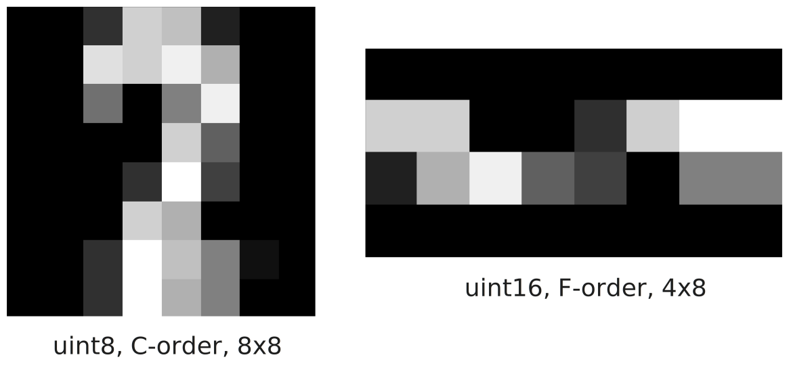
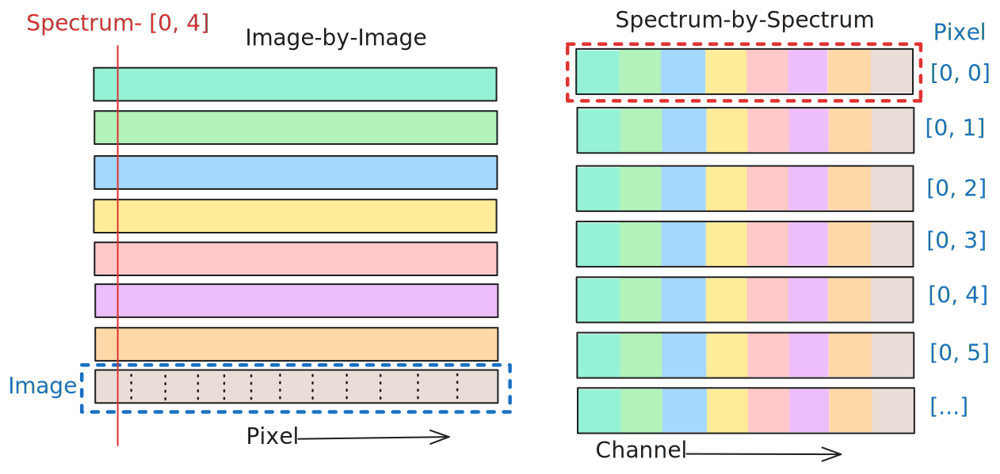

<!--_footer: 'Slides: [matbryan52.github.io/microscopy-images-qem](https://matbryan52.github.io/microscopy-images-qem/)' -->
<!--<!-- _footer: `This version is static, all interactive slides are converted to images` -->-->
<a name='start'></a>


# **What is an image?**

Matthew Bryan
*CEA-Leti, Grenoble, France*
[matthew.bryan@cea.fr](mailto:matthew.bryan@cea.fr)
GitHub: [@matbryan52](https://github.com/matbryan52) / [microscopy-images-qem](https://github.com/matbryan52/microscopy-images-qem)
</img></img> 

---
<!-- footer: '</img></img> [↞](#start)     Slides: [matbryan52.github.io/microscopy-images-qem](https://matbryan52.github.io/microscopy-images-qem/)' -->
<!-- paginate: true -->
<!--
A microscope lets us see, for a time

An image lets us look again
-->
<!-- _class: columns2 -->
<style scoped>
img, span {
    display: inline;
    vertical-align: middle;
}
</style>
# Who I am

Matthew Bryan<br />
[@matbryan52](https://github.com/matbryan52) on GitHub


**Research Software Engineer**<br />
  Grenoble :fr:  Alps :mountain_snow:

Background:

- fluids + engineering
- image processing
- computer vision

Not really a Microscopist!
<br>

Developer on the <a href="https://libertem.github.io/LiberTEM/"></a> project
<!--
I mostly work with Python so I am afraid these slides are biased, if you work more in Matlab just add one...
-->

---
<!-- _header: '[CEA-PFNC](https://www.minatec.org/en/research/minatec-dedicated-research-platforms/nanocharacterization-platform-pfnc/)' -->

<!-- 
I'll just take a moment to mention where I work

The French atomic energy agency, CEA has a site in Grenoble with a strong focus on nano-materials development and characterisation

There is a medium-sized clean room, and an advanced nano-characterisation platform, the PFNC, including a number of fairly recent corrected TEMs, with sample preparation facilities. It is part of a number of research networks including METSA in France, so there are possibilities to come use the platform if your project fits within the right criteria.

More than just TEMs, as I said, there are over a 100 people working on all types of nano-characterisaion under one roof, including surface science, x-rays, optics, NMR, ions, etc.
 -->

---
<!-- _class: columns2 -->
<style scoped>

h1 {
  column-span: all;
}

</style>
<a name='contents'></a>
# Content

- [Images](#photographs-images)
- [Digital Images](#images-as-information)
- [Visualisation](#visualising-images)
- [Signals](#sampling)
- [Geometry](#transforms)
- [Filtering](#image-filtering)
- [Segmentation](#segmentation)
- [Enhancement](#restoration)
- [Alignment](#alignment)
- [Summary](#summary)

<!-- 
So, on to the content. We're going to cover a lot of topics from a high-level as you can see. The slides may be way too long, I didn't have any opportunity to practice to get a feel for the timing, but I'll try not to rush and if we don't make it to the end then no worries, they're all online if ever some of you want to see the rest.

I made the conscious choice to not include many equations or derivations of the different approaches I show, because in practice I find that I rarely if-ever have to write the basics from scratch. Instead it's about knowing what exists and combining the building blocks in clever ways. So what I've done is include links in the header of every slide that introduces a tool, and those links point to the (usually) Python library that implements that tool, usually with an example which is much better than what I could show you here.

Again I'll mention that the slides, figures and all the source code are online at the address below if ever you want to flick ahead or through the content, or use the figures for something else, it's all MIT license which means free for any use with no restrictions on modification or adaptation.
 -->

---

<!-- footer: '</img></img> [⇤](#photographs-images) [↞](#contents)' -->
<!-- _class: columns2 -->

<a name='photographs-images'></a>

<br/><br/>
# **Images and Photographs**

")
<!--
- Found it quite hard to introduce digital images without talking about images more generally first
- Sit through yet another introduction to image formation in optics and how a camera works
- At least, though, it'll be brief - I'm not the person to talk in detail about ray diagrams and sensor design
-->

---
<!-- _class: columns2 -->
<!-- _header: '[phydemo.app](https://phydemo.app/ray-optics)' -->
## Images

In optics, an Image is a plane with a **one-to-one** mapping between ray origin points and ray destinations

> All rays leaving one point on an object arrive at the same point in the image

Recording the rays on this plane will give a **spatially correct representation** of the object

> Of course, this becomes *much* more complex when the optical system is imperfect, or an object has depth!

<iframe src="https://phydemo.app/ray-optics/simulator/#XQAAAAIvAwAAAAAAAABEKcrGU8hqLFnpmU9ERVKNOwYP0VFzpPh8n-czL7tpfJxDes0nUi4X5y7_y0uPMb9ieg2zDQ4Fai9FprUBHtHsbp0lrmGX-O_GtPhvuIo2Zz27oV-uDhlbCT866FKFfzI_qgi4GOTF3wWN2MfN72Thb0ngtTQ5r2NrNzpZxVCA-PBmqyR3GMJ_NB24-QUhnRciYj7WX7SwjjRNIJMORwr8nmQatee0tkE2nbAJxLhSTGCtAnLVt0EQoNjKgZR8BhO-9FpbZCwBMY3kqViyujkNJ72AmQXd05tLXPu_oTB8yXmmDRjP7ZXruLe5tgYZTZXLqTaKk2s8b5Xdo6HMMy6IGAf0j3bWfmrrP-wO6DgHvEexQrrp45GqTo9G-HHqjnMho_WNfz13tOHIWJerE3V9oBAUM_vff99QPeaDa-ZFWMZWTLLyDfv3hd5_xKPhrxvB5mfJT9FmYsmLxEUqQFQ1TRXEk0O2M_JOt_RTB966H3C4Ic5Lz2Z6XX4_a-uTq5j5jQlvC1tP_3KlUXUIBYvcNmoHARCB3EkW37aE2ZpZqaVYDa25Su-4JmyAY8lOilLhsp1mu9KcW8nbS743kutZdwQQhwiJnhJYgjkda-oyQMkW87lzwZwSBEnv_-qPdQ4" width="600px" height="600px" frameBorder="0"></iframe>

<!--
- The way I see Image formation is through the idea of ambiguity.
- Every point being hit by light is effectively a point source sending more light in all directions
- If there is a place where all of the light from a given point converges again to a point, then here we have an image of that point
- If a lot of points share a surface on which their light converges to points, then this is an image plane and here could record that light to create what we'd call in normal speak an image, e.g. a photograph or a selfie or whatever

That said in the real world we never have perfectly flat objects, or perfect lenses, so there is always some ambiguity of where the light is coming from, we just set up the system so that the light we want overpowers the light we don't, and our image is only slightly flawed as a result.
-->

---
<!-- _header: '[Film grain](https://en.wikipedia.org/wiki/Film_grain)' -->
<!-- _class: columns2 -->
##  Analogue images - Film

Recording light in chemical reactions

- Light- (or electron-) sensitive coatings that transform when **exposed**
* Sensitivity determined by (chemical) reaction rate (temperature, wavelength etc.)
* **Resolution** determined by average particle size - randomly distributed!
  * In practice film is extremely densely coated

<span style="font-size: smaller">Micrograph of film grain</span>
<figure>
<iframe src="http://localhost:9091/film-particles" width="560" height="450" frameBorder="0"></iframe>
<figcaption style="text-align: right; font-size: 16px"><a href="https://www.photomacrography.net/forum/viewtopic.php?t=26857">photomacrography.net</a></figcaption>
</figure>

<!--
So to create what we'd call an image in normal day-to-day speak we need to record a lightfield
Back in the day this would be done with film, and light-sensitive chemical reactions did their thing in response to the local intensity of light. Usually some kind of metal salt is crystallised onto a substrate, this being light sensitive, the light causing the initiation of formation of the metal itself, which is of course opaque.
The fidelity of the recording was very much dependent on the chemistry, temperature, formulation, age of the film, particle size distribution etc
-->

---
<!-- _header: '[YouTube @AppliedScience](https://www.youtube.com/watch?v=-qETedzsFIE)' -->
##  Analogue images with plants

Any light-reacting chemistry could be used to record a photograph, even photosynthesis!


<!--
Just as an aside, I wanted to share the existence of this video by Ben of the Applied Science channel on YouTube, where he describes in great detail the process of taking photographs using Geranium leaves and photosynthesis as the reaction. The development process is a bit complex as you have to wash out the chlorophyll in a particular way, but he got pretty good results if you ask me. I highly recommend his channel for lots of interesting experiments. 
-->

---
<!-- _header: '[phydemo.app](https://phydemo.app/ray-optics)' -->
<!-- _class: columns2 -->
## Digital images

Recording images with numbers

- Convert local light intensity to an electrical signal, then **digitize** it
- Sensors have physical limits, noise etc, so our digitization is always imperfect

<br>

At the most basic, a digital image is a list of numbers representing recorded *values*, and a way to structure these numbers into a shape we can interpret as the physical image

<iframe src="https://phydemo.app/ray-optics/simulator/#XQAAAAKoAQAAAAAAAABDKcrGU8hqLFnpmU9EnTFrVrE8e3iP9Y30xRLJ53U7Paz6ugKVEwiDoPkxYUkq34GuEo6E2A0lkN0NikvTataLtnGNq-BY93Sx571NfVdBMLmS--Ri7mZ3MjIXDjOVYtv135J31N7_bGxN7zPocEaQXCE-OxZsZLPneE4vLmYjQ2ff4n3G7OTz3o3INHFolvsUICepqvGpgvPO-b6RlqNRHgrkkmxLAFprnIq_YthCr-nYpwa4SlCmNlNhGhbtPwnZ6GPvaGHMI0Pje0DTsTxa1CY61RtSxFRC9DNHIwEDY_252nTLMjsEdwWO-QVxGXgtOctUijSsAzhw5N9HadZrpIG_x6Q8G-SK9pQh7YhDWh9fzaGy-KnuVRzbxMomPikPdypOQfDeM2ilNflulbNeGVv_TlIIAA" width="600px" height="600px" frameBorder="0"></iframe>
<!--
Of course, photographs are now old news, unless you're into large format or retro-revivalism or something. We almost exclusively take digital image now and many of them given how many cameras are always around us. Rather than using a chemical reaction we record the light field by some kind of conversion to charge or voltage, and then using the magic of electronics to convert this to binary data. We still hope to have a representitive recording of the lightfield at the end, though real imaging sensors have issues like saturation, noise, speed, dynamic range etc.
-->

---
<style scoped>h2 { position: absolute; top: 5%; }</style>
## Rays to Digital Image


<!--
So here we are, the conversion from rays of light to numbers in a very schematic way, incident intensity is proportional to voltage or some other physical quantity, this is digitized using an Analog-to-Digital converter, sometimes directly in the pixel sometimes row-by-row, or zone-by-zone, that depends on the camera hardware, but at the end you have a big grid of numbers that we hope is representative of the light-that-was.
-->

---

## What are pixels? Resolution?

A *pixel* is an **el**ement of a **pi**cture. In acquisition it is the sampled value at a given position.

- Represents a single, discrete intensity from the wavefront that was recorded

You may also encounter the term *voxel*, which is an **el**ement of a **vo**lume in 3D

<hr>

Resolution, depending on the context, can be pixel spatial **density** (i.e. how well we can *resolve* two adjacent peaks), or total pixel **count**, usually as a 2D shape e.g. `(height, width)`.
<!--
You have certainly heard the word Pixel, and I wanted to note that is a contraction of the words "picture element" and dates from the 50s or 60s, and is the name for one of the values we record on a digital camera. Of course the word didn't exist before digital imaging, as photographic film is not structured on a grid or structured in any way, it's hard to define one value in a photographic image.

Resolution, then is either the number of pixels you have in you image, or on you camera or screen, and their shape, especially if you're talking to a regular person. In some more technical contexts resolution might also be the pixel spatial density as it's related to how finely we sample the lightfield and so how much detail we can ultimately capture.
-->

---
<!-- _header: 'Python: [xarray](https://docs.xarray.dev/en/stable/), [HyperSpy](https://hyperspy.org/hyperspy-doc/current/user_guide/axes.html)' -->


## Calibrations

Digital images are discrete, both in space and value

- Position within a digital image is given by an integer coordinate:
  - `[3, 5]` not dimension `[0.2 cm, 0.8 cm]`
- Intensity is usually recorded as an integer value
  - `530` not a physical quantity like $3.2\: J$

Interpretation of digital images in physical units requires a **calibration**, accounting for (amongst others):

- Pixel size, spacing, shape
- Sensor response, readout characteristics

These values *may* be found in the image **metadata**, if you're lucky!
<!--
It should go without saying that there is a lot of conversion involved between the light and the digital image on a computer, and so pixel values don't really have meaningful units out-of-the box. You might be lucky and have metadata for an image that tells you things like the pixel spacing, readout gain or offset, but rarely will this let you generate a true "number of photons per mm2" value.
-->

---
<!-- _header: '[Wiki](https://en.wikipedia.org/wiki/Bayer_filter)' -->
<!-- _class: columns2 -->

## Colour images

A colour image is a stack of images of the same wavefront, each sampling one part of the spectrum

- We are most familiar with <span style="color:red">Red</span><span style="color:green">Green</span><span style="color:blue">Blue</span> (<span style="color:red">R</span><span style="color:green">G</span><span style="color:blue">B</span>) images
- These are usually made with a pre-sensor **Bayer filter**, which samples colour differently in adjacent pixels
- The recorded values are split into separate <span style="color:red">R</span>, <span style="color:green">G</span>, and <span style="color:blue">B</span> intensity images

The three **channels** in the `[heigh, width, colour]` stack are spatially offset, but with intelligent recombination we can display them without artefacts

")
<!--
I wanted to mention how true colour images work, even if in electron microscopy there isn't really such a thing. A lot of colour sensors use a thing called a Bayer Filter, which selects light from certain wavelength bands in the red, green and blue parts of the spectrum for individual pixels. Green is recorded twice as our eyes are particularly sensistive here. This forms a single gray image with a different response in different pixels, but we can electronically separate the different sub-images and recombine them to display something like the colour we would have seen. Of course there is a slight offset between the four sub-images, a kind of intrinsic chromatic abberation, but if they are recombined intelligently then we don't really notice, especially if the pixel grid is dense enough.
-->

---

## Spectral images

Spectral images are a generalisation of colour images, where each **channel** represents a well-defined band of energy.
* Ideally spectral channels don't overlap in energy, unlike many colour image filters
* We normally can't sample both spatially and spectrally simultaneously, so we create images *channel-by-channel* (e.g. EFTEM), or *position-by-position* (e.g STEM-EELS)


<!--
A bit closer to home, spectral images are just colour images but acquired with some kind of filtering, usually with a bit better separation between channels than RGB colour. It would be rare to see something like a Bayer filter in science, too, rather we have something like a spectrometer to record only one energy at a time, and we spread the recording over multiple acquisitions while politely asking the sample to not move.

At the end of the day, whether colour of spectral imaging, we still have a list of sampled numbers, now with an extra dimension of energy or channel, as well as height and width.
-->

---
<!-- footer: '</img></img> [⇤](#images-as-information) [↞](#contents)' -->
<!-- _header: 'Image: Jean-Luc Rouvière' -->
<a name='images-as-information'></a>

# **Images and Computers**


---
<!-- _header: '[sklearn: MNIST digits](https://scikit-learn.org/stable/modules/generated/sklearn.datasets.load_digits.html#sklearn.datasets.load_digits)' -->
<!-- _class: columns2 -->
## Arrays of numbers

Computers store numbers long sequences of binary digits (`0`, `1`), which we can interpret to reproduce an image with a given shape

> Images are 1-dimensional **sequences** of numbers to a computer, there is no hardware-level concept of `height`, `width`, `channel` etc.

Numbers can also be stored using different rules, leading to even more ways to (mis-)interpret an image.

The numbers:

```
0000000000000000000000110000110100001100000000100000000000000000
0000000000000000000011100000110100001111000010110000000000000000
0000000000000000000001110000000000001000000011110000000000000000
0000000000000000000000000000000000001101000001100000000000000000
0000000000000000000000000000001100010000000001000000000000000000
0000000000000000000000000000110100001011000000000000000000000000
0000000000000000000000110001000000001100000010000000000100000000
0000000000000000000000110001000000001011000010000000000000000000
```

Can be equally interpreted as:


<!--
Right, we've been talking like an image is essentially a photograph but digital, but in reality a computer is not built to work with data that has such a meaning. A computer holds an image as a one-dimension list of binary numbers of a certain length, and we apply a set of conventions to these numbers to make it behave like the image we recorded. We have to tell the computer somehow how many binary numbers make up a single pixel, in what encoding, and also how we ordered our pixels, whether row-by-row or column-by-column, or even completely randomly or by block if you want to make life hard. Only with these rules will any operations on the numbers give the right results, or will the image display on the screen correctly. On the screen you see a representation of a hand-drawn number 2 (though very small) in binary, and also how it is meant to be interpreted on the left, and a really bad interpretation on the right, but take note that the data in both cases is identical!

Luckily in practice we rarely have to think about this kind of thing, there are enough conventions and common practice that we can just expect things to work most of the time, and when it doesn't work right it gives people like me something to do or to complain about.
-->

---
<!-- _header: '[numpy: dtypes](https://numpy.org/doc/stable/user/basics.types.html)' -->
<style scoped>
table {
  font-size: 20px;
  display: block;
  margin: 0 auto;
}
</style>
## Number types

There are many conventions for storing numbers as binary, here are some common ones used in images. Usage depends on your camera electronics and what processing you do.

|                  | Names      | Size (bits or digits) | Min          | Max        | `0100000001001001`<br>`0000111111010000` |
| ---------------- | --------- | ----------: | -----------: | ---------: | ---------: |
| Binary           | `bool`      | 8           | 0            | 1          | `-` |
| Unsigned Integer | `uint8`, `ubyte`     | 8           | 0            | 255        | `64`, `73`, `15`, `208` |
|                  | `uint16`    | 16          | 0            | 65,535      | `18752`, `53263` |
| Integer          | `int16`, `short`     | 16          | \-32,768      | 32,767      | `18752`, `-12273` |
|                  | `int32`, `long`     | 32          | \-2,147,483,648 | 2,147,483,647 | `-804304576` |
| Floating (Decimal) | `float32`, `float`   | 32          | \-3.40E+38   | \-3.40E+38 | `3.14159` |
|                  | `float64`, `double`   | 64          | \-1.70E+308  | 1.70E+308  | `-` |
| Complex          | `complex64` | 64          | \-3.40E+38   | \-3.40E+38 | `-` |
<!--
I mentioned that binary numbers are what a computer sees, and these only have meaning to us if we apply some information about how to interpret them. I won't go into much detail but we have different rules for storing integer and decimal numbers, with impact on the number of digits needed to store such a format and the minimum and maximum values we can represent with such rules. The usage of all of these depends on your application, but typically unsigned integers come out of cameras, as we only have a limited range of values the sensor can produce and these are rarely negative, while floating and complex numbers are of course more meaningful when we start doing operations on the image.
-->

---

## Number types - Notes

- Digital numbers are stored in a fixed amount of space - exceeding the min or max for a type can cause **wrapping**, e.g. `200 + 100 = 44`!
  - `uint8` has a maximum of `256`, so $200 + 100 = 300$ ⇒ `300 mod 256 = 44`.
* The size of the number `=` the space it requires in memory and on disk
  - No reason to store 8-byte `float64` if values are only `0` or `1`
  - Often larger types ⇒ slower computation
* Floating point numbers have **variable precision**, i.e. they can represent *very large* or *very small* values, but cannot represent a large number with a small fraction:
  - `float32(324,000) + float32(0.0055) = float(324,000.0)` and not `float32(324,000.0055)`
<!--
The choice of number type has implications for what you can do with it, a common issue with small types like 8-bit integers is "wrapping", i.e. unexpected results when an operation overflows the maximum or minimum value a type can hold. This is much less common with languages such as Python which try to protect you as much as possible from low-level details like this, but it can still happen! That might even be worse, as you might not be expecting it.

Take note of the point that number type influences the storage requirements of an image as well as the time to process it. If you notice that suddenly an image has doubled in size on the disk you might have accidentally changed its number type from 16-bit to 32-bits per number, for example, without really much justification.

A reality of decimal or floating point numbers, even in Python, is loss of precision when trying to work with both small and large numbers at the same time - as you can see here adding 324k and 0.0055 together as float32 just drops the 0.0055, which may or may not be important to your application. Doing this using float64 would have worked fine, but takes up twice the space in memory and is usually slower to compute.

Complex numbers are stored as a pair of floating numbers representing real and imaginary parts, there are no native complex number formats
-->

---
<style scoped>h2 { position: absolute; top: 3%; }</style>
<!-- _header: '[numpy: memory layout](https://numpy.org/doc/stable/dev/internals.html)' -->
## Memory layout

A 2D image is usually ordered **row-by-row**, or **column-by-column**, by convention. As each number occupies a fixed number of bits in the sequence, we can find the value of any pixel by *row/col arithmetic* and then **indexing** according to the layout in memory.


<!--
So here you have a representation of an image in 2D, with height and width or rows and columns, then two ways you could unpack that image into a linear sequence in memory, rowwise or columnwise. The consequence is that any given pixel in the 2D representation will exist at a different location in the memory according to how we unpacked it, and we need to do the correct arithmetic to find it again.
-->

---

If an image is large and >2D, e.g. a spectrum image, then memory layout can heavily affect processing time. **Jumping** between memory locations is very slow compared to sequentially reading memory, so it pays to store data in the way it will be processed.


<!--
This is particularly important for spectral data and 4D-STEM as the way we unpack the data into a sequence in memory determines how we can access it later. It's important to take away that accessing data which is sequential in the memory is very very fast, while jumping around to pick out every 100th value is very slow. If the processing to do is usually on whole spectra then it pays to store the values spectrum-by-spectrum, while if you need whole images for a given channel, it pays to store it image-by-image.

Of course, you rarely get a say in this with modern hardware and software, which is sometimes a shame, but I point it out in case any of you are confronted with processing which is bizarrely slow, it's something to think about.
-->

---

## Multi-image data, stacks, 4D-STEM


Tomography can an add an extra `[tilt]` dimension to all of the above!
<!--
With all that said here are some representations of different data, with their shapes and sizes. You might be able to appreciate that if I need to extract the centra pixel from every single frame in a 4D STEM dataset then there is a low of jumping around in memory, especially if we are talking about data on a harddrive where we might only be able to traverse the data at a few hundred MB/s.
-->

---
<!-- _class: columns2 -->
## Coordinate systems

Depending on the tool or programming language, image coordinate systems vary

- Matrix notation in 2D: `[row, column]`
- Python is **0-indexed**
  - `image[0, 0]` is the first pixel
- MATLAB is **1-indexed**:
  - `image[1, 1]` is the first pixel

Extra dimensions e.g. `channel`, `scan` are according to convention (and sometimes also memory-layout).


Typically `row == 0/1` at the **top** when displayed, with positive-**down**

---

## Maths with images

As an image is just a list of numbers, so we can do arithmethic or more complex operations on images to yield new images or other results. For example:

```python
image = image - image.min()  # subtract the minimum value in the image from every pixel
px_sum = image[5, 7] + image[2, 4]  # sum the values in two pixels
image = log(image)  # take the natural logarithm of every pixel
wavefront = exp(-1j * image)  # interpret the image as phase and create a complex wavefront
sum_image = image + other_image  # sum two images together
```

Note that when operating on pairs of images they must have the same `shape` for the elementwise calculation to be defined.

---
<!-- _header: 'Image: Hanako Okuno / Tescan + [Wikipedia](https://commons.wikimedia.org/wiki/File:Felis_catus-cat_on_snow.jpg)' -->
<style scoped>h2 { position: absolute; top: 3%; }</style>
## Maths with images

<iframe src="http://localhost:9091/image-math" width="1150" height="600" frameBorder="0"></iframe>
<!--
And just to prove my point, here we can try some maths with images live, right now we've computed the image times -1, note the colourbars on the right. We can try adding 5 to the images, ... see. If I copy this example here we will multiply our image by a ramp from left to right. ... We can also add or subtract images together, for example the image and the inverse image will give 0 everywhere, I hope ..., or if we add another image we see see details from both.
-->

---

## Image file formats

Images can be stored in many ways, depending on how they are used

- `.jpg`, `.png`, `.gif`: colour RGB `uint8` images, compressed for small file size, open anywhere without special software, not for scientific *data*, just **visualisation**
* `.tif`: a **general-purpose** image format, can hold most number types and shapes
  - TIFF files with strange data (floating point) may need special software
  - Can hold additional metadata (e.g. calibrations), can be compressed
* Proprietary formats like `.dm3/4`, `.mib`, `.emd`, `.blo`: specific to a certain camera or software, not always readable elsewhere
* General *array* formats: `.mat`, `.npy`, `.hdf5`, `.zarr`: flexible, can be compressed, can hold stacks / nD data and metadata, need compatible code/software
<!--
In microscopy we come across a panoply of different image file formats, and everyone has their favourite. A lot of the unusual ones are specific to a particular camera or equipment vendor, and can normally only be opened in their software or a few open-source packages. Then you have more general formats for binary data, which won't necessarily re-create your image for free, you need to supply the interpretation. TIFF is probably the only format capable of both representing scientific data well while also being openable on most devices without special software - though not always. It can hold decimal and complex numbers but Windows Image Viewer won't do well with that kind of file. Then at the bottom of the ranking you have general colour image formats, these can rarely if ever hold anything other than 8-bit integers, so 0-255, which are good for visualisations or PDFs, but not at all good for analysis.
-->

---
<!-- _header: 'Python: [`sparse`](https://sparse.pydata.org/en/stable/), [`scipy.sparse`](https://docs.scipy.org/doc/scipy/reference/sparse.html)' -->
<!-- _class: columns2 -->

## Sparse images

In very low dose conditions (e.g. EDX), most image pixels contain a **zero value**. This is good use case for *sparse* images.

> Storing only the **non-zero values** can achieve enormous space savings
* Simplest strategy is store non-zero values and their coordinates, but more intelligent schemes exist
* Many operations are $f(a, 0) ∈ \{0, a\}$ so also avoid wasted computation


<!--
I wanted to mention sparse images since not everyone is aware of them. A sparse image is a way of storing an array of data where most of the pixels are some constant value, usually zero, and so rather than unravel this array into a long sequence of zeros in memory, we just don't bother and store only values which are non-zero as well as where they should be.

As you can see on this tiny example we saved about 75% of the storage space, depending on the sparsity and how you store the data this can rise to 90-95%. An added benefit is that certain operations are much faster when we can ignore zero values - for example an element-by-element dot product between one image and another, we can cut down the number of multiply and add operations by 95% if we just don't bother to process zero-value pixels.
-->

---

## Image software

Useful software packages to work with images in microscopy

---

### Fiji ([imagej.net](https://imagej.net/software/fiji/))

Widely used in scientific imaging, plugins...


Calibrations, stacks, measurements, math, segmentation...


---

### Napari ([napari.org](https://napari.org/))
Multi-D data viewer, annotations

Python-based, easy to add analysis


Good support for 3D volumes


---

### Gatan Digital Micrograph ([gatan.com](https://www.gatan.com/installation-instructions))
Well-known, feature-rich GUI even when using the free license

Python scripting enables any analysis with GMS display


---
<!-- _header: 'Python: [`numpy`](https://numpy.org/)'-->
## Python libraries for images

The Python scientific ecosystem is vast - once an image is loaded as array data, typically under `numpy`, it can be interpreted in many ways.

<hr>

`numpy` is the general **array** manipulation library for Python. It provides:

- The data structure for multi-dimensional arrays, including images
- Fast implementations of basic operations on these arrays

```python
random_image = = np.random.uniform(size=(64, 64))  # random image 0..1 of shape [64, 64]
theta = np.arctan(random_image)  # array of radian values computed from image
phase_image = np.exp(1j * theta)  # phase image from theta values
```

---

`scipy-ndimage` ([docs.scipy.org](https://docs.scipy.org/doc/scipy/reference/ndimage.html))

- Low-level tools for images (e.g. convolve, interpolate, measurements)

`scikit-image` / `skimage` ([scikit-image.org](https://scikit-image.org/))

- High-level tools for images (e.g. resizing, alignment, segmentation, filtering)


---

`matplotlib` ([matplotlib.org](https://matplotlib.org/stable/))

- General plotting library
- Can directly `imread` + `imshow` images
- Good for combining images with results + annotations

```python
plt.imshow(image, cmap="gray")  # plot an image with gray colourmap
plt.scatter([32, 43], [16, 25])  # annotate with some points
plt.show()
```


---
## Graphics Processing Units (GPUs)

A Graphics Processing Unit (GPU) is a computation **accelerator** which can be added to computers. They can be used to speed up many forms of scientific computation.

* GPUs are specialised to perform simple math **operations in parallel** on multi-dimensional arrays of data (such as images)
* Operations for 3D graphics (coordinate transformations, filtering, raytracing), the original usage for GPUs, are frequently identical to math needed in scientific computing (FFTs, convolutions, matrix algebra and inversion).

<!--
So I've been asked to speak about GPUs, which I am sure most of you have heard of especially with the recent boom in so-called AI.

GPUs are a computation accelerators, they let us do fairly basic maths in a very parallel way on one device. They enabled the current AI boom because most AI training can be reduced to trillions of multiply-and-addition operations, and GPUs can do this in parallel on thousands of input values in one step. Lucky for us we can get the same boosts with images, especially as GPUs were originally designed to generate and work on image data for video games, things like coordinate transformations and filtering are essentially what we do in scientific computing, and so GPUs are great when the computation to do is quite heavy.

There's not much point with small images or small data, however, as GPUs have a certain overhead. An operation which takes 1 ms on a normal CPU will probably take much longer on a GPU unless the data are already inside the GPU - the time to transfer the data to the accelerator will massively outweigh the processing time if that is all we are doing.

Luckily, at least in Python, there is very little we have to do to make code run on a GPU as opposed to CPU, unless you want to extract the maximum performance you can more-or-less change one letter and add a few magic incantations and suddenly your code will use the GPU if desired.
-->

---
<!-- _header: 'Python: [`cupy`](https://cupy.dev/)' -->
<!-- _class: columns2 -->
## GPU code in Python

At least in Python, it is **reasonably trivial** to make code run on GPU rather than CPU, thanks to the standardisation efforts behind the teams behind [numpy](https://numpy.org/) and [cupy](https://cupy.dev/).

> Many math functions have been re-implemented on GPU, and are used nearly the same as the CPU equivalent

For example the following using CPU:

```python
assert large_image.shape == (4096, 4096)

import numpy as np
img_fft = np.fft.fft2(large_image)
```

runs in `~1 s`, but is equivalent to:

```python
import cupy as cp
img_fft = cp.fft.fft2(large_image)
```

and runs in `~1 ms` on a large GPU.


---
<!-- footer: '</img></img> [⇤](#visualising-images) [↞](#contents)' -->
<a name='visualising-images'></a>

# **Visualising images**


---

## Image histograms

An image histogram represents the **frequency of intensity** values in an image. It is a useful way to visualise the separation between background and content, and to see outlier pixels.


<!--
Perhaps a bit basic, but worth mentioning - image histograms show us the distribution of intensity values in an image, they are ubiqutious in image software, and as long as the axis limits are clear they can be useful in spotting when an image is saturated or clipping, or if we are using the full dynamic range of the image type correctly.
-->

---

## Data → Screen

Screens usually display `uint8` <span style="color:red">R</span><span style="color:green">G</span><span style="color:blue">B</span> colour (3 values of `0-255` per-pixel, also known as 24-bit colour). Unless our image was acquired in these three channels then we need to **transform** our data from recorded intensities to screen <span style="color:red">R</span><span style="color:green">G</span><span style="color:blue">B</span>.

- If we recorded intensity, then setting <span style="color:red">R</span> = <span style="color:green">G</span> = <span style="color:blue">B</span> on a screen gives colourless **Gray**
  - This limits us to **only 256 levels** of intensity to display all of the data range
  - If our data are more than 8-bit, need to sacrifice detail or clip values
- We can use artificial colour to achieve more on-screen contrast, known as a *lookup table* or **colormap**, of which there are many choices for different applications.

Choice of data transformation or colormap can massively influence how data are perceived.
<!-- Something about other colourspaces? -->

---
<style scoped>h3 { position: absolute; top: 3%; }</style>
<!-- _header: 'Image: Jean-Luc Rouvière' -->

### Transformation: Brightness + Contrast

The basic data-to-screen transformation is linear: `[img.min(), img.max()] → [0, 255]`.
The **brightness/constrast** transform chooses two other values and **clips** pixels outside their range to `0` or `255`. This removes detail in some regions while increasing it in others.

<iframe src="http://localhost:9091/brightness-contrast" width="1150" height="475" frameBorder="0"></iframe>
<!--
Here we have a demonstration of brightness and contrast adjustment on an image display - note that the data are not changing, only the mapping from data to the colours shown on screen. Our data are in the range .., while the colours are 0 to 255, and the slope and position of the line determines the map between a section of the data range and the colourmap. Any values outside the range that is on the slope are clipped to 0 or 255 depending on whether they are before or after it. As I adjust the contrast note how part of the image become pure white or black, and the rest becomes sharper.
-->

---

## Dynamic range

Dynamic range usually refers to the difference between the minimum and maximum value that an image could possibly represent, i.e. how much **depth of intensity** we can store without saturating at the top-end, or recording only zeros at the bottom.

> In microscopy we often have data which span orders of magnitude in intensity (e.g. diffraction patterns).

When brightness/contrast cannot cover the dynamic range of an image, a **non-linear mapping** between data and colour can be used, trading local for global contrast:

- Log-colour rescales data by its magnitude → $I_{disp} = \log (I_{img})$
- Gamma-colour scales the data with a power law → $I_{disp} = I_{img}^\gamma$

---
<!-- _header: 'Image: Gustav Persson' -->
### Transformation: Gamma + Logarithmic

<iframe src="http://localhost:9091/gamma-log" width="1150" height="550" frameBorder="0"></iframe>
<!--
Here we have a logarithm transform on the data before display - note how low values are given more of the vertical range between 0 and 255 while higher values are on the flatter part of the curve so are represented by fewer values. The effect is we can see more detail at the low end at the cost of effective saturation at the high end. The Gamma transform does more or less the same thing for certain values of gamma, but now we can choose how the values are mapped.
-->

---
<!-- _header: '[Kovesi (2015)](https://arxiv.org/pdf/1509.03700), Python: [`colorcet`](https://colorcet.holoviz.org/)' -->
<!-- _class: columns2 -->
## Colourmaps

Colourmaps are critical to how we interpret visual data. It is important that features we see are from the data and not the map.

> Some colourmaps are made to be **perceptually uniform** - a $\Delta$ in the data is perceived as the same *visual* $\Delta$ to our eyes, across the whole range of the colourmap.

Non-uniform colourmaps can create visual features which do not exist, or hide real information.

<iframe src="http://localhost:9091/colour-uniformity" width="600" height="650" frameBorder="0"></iframe>
<!--
Choosing a good coormap for the data is really important, as it can massively affect interpretation. More contrast is not always better, if all we are showing is quasi-random noise on a rainbow colour scale. But even if sometimes a rainbow map is a good choice, I want you to take away that there is more than one way to build a rainbow, some of which are more honest than others. See here for example the two different colourmaps displaying a simple linear ramp ... without other context which of the two looks like more interesting data ? We have a way to visualise this a bit which is to superimpose a sine wave on top of the ramp, which means we make the colour oscillate along the map. That oscillation represents our eye's ability to distinguish a value change between two different points on the colourmap, and ideally we should feel like the oscillations are "equal" everywhere. So 0.05 change around 0.2 is visually the same as a 0.05 change at 0.9. This is called perceptual uniformity.Another example are the two colourmaps Hot and Fire, both well-used in some fields, but only one was designed to be uniform, can you tell which one. Finally there are specialised colourmaps when the data warrant it, look here at this data with both negative and positive features at different scales, a normal colourmap makes it hard to know where the zero level is, while a diverging colourmap forced to be symmetric around 0
-->

---
<!-- _header: '[davidmathlogic.com/colorblind](https://davidmathlogic.com/colorblind)' -->
## Colour blindness

Certain colour blindness forms are experienced in 1-5% of the population (biased towards males). Choice of colourmap can hugely impact the perception of data for these groups.

- In particular try to *avoid* using <span style="color:red">Red</span>–<span style="color:green">Green</span> to draw distinctions, as this is the most common form of colour bindness


<!--
A factor which is often overlooked in data visualisation is the fact that not all of us see colour in the same way, and up to 5% of people, mostly male, have some form of altered vision. The most common form is weak red-green vision, meaning that red and green tones appear similar, as in this visualisation. This would be quite extreme but note that the simulation is effectively two-tone, blue and yellow. Given the size of this room it would not be surprising if a few people here are partially colourblind. There are a lot of colourmaps which are mostly colourblind friendly, including Viridis which is the default in a lot of packages. In general if a colourmap looks like a rainbow, there is a greater chance it will be a bad choice for some people.
-->

---
<!-- _class: columns2 -->
<!-- _header: 'Python: [Matplotlib](https://matplotlib.org/stable/gallery/images_contours_and_fields/image_transparency_blend.html), Image: Tescan / CEA' -->
## Transparency (Alpha)

Digital images can also be combined or overlaid using transparency, called **alpha**.

> Transparency can be defined on a **per-pixel** basis

For example a low-count area in an EDS map can let the HAADF show through.

- When working with colour images you may see `RGBA` where `A` is a 4th "colour" channel used for alpha

<iframe src="http://localhost:9091/transparency" width="500" height="600" frameBorder="0" style="display:block; margin: auto;"></iframe>
<!--
Transparency is another lever along with colour that we can pull to visualise our data. In practice it just means that a pixel doesn't just replace what was already on the screen, rather it is combined in a weighted sum with what was already there. It's not particularly useful to denote data itself, as we have a hard time interpreting the transparency once it is drawn, but it can be used to help denote a lack of data or density of sampling.
-->

---

## Complex and 2D-vector images

For complex images we must choose how convert **real** + **imaginary** into an standard image.

- A typical example is in holography, where the reconstruction is complex
  - The `abs()` of the wave represents the amplitude
  - The `angle()` of the wave displays the phase

We also need to be careful about how to display periodic phase with a colourmap:

- We can use a **cyclic** map → lose visualisation of phase ramps.
- A common technique to work around this is **phase unwrapping**
<!--
Vector values are harder to display with a colourmap, and in some cases it is easier to use a different style of plot like a oriented arrows where length encodes magnitude. A cyclic colourmap wraps around to the same colour at 2pi, which can represent direction, and in some cases we can also represent magnitude using saturation of the colour. This becomes quite complex to visualise unless the viewer is used to it, though!
-->

---
<style scoped>h3 { position: absolute; top: 5%; }</style>
<!-- _header: 'Python: [`skimage.restoration.unwrap_phase`](https://scikit-image.org/docs/0.25.x/auto_examples/filters/plot_phase_unwrap.html), Image: [Grillo et al. (2020)](https://zenodo.org/records/3878720)' -->
### Complex image display

<iframe src="http://localhost:9091/complex-image" width="1050" height="600" frameBorder="0" style="display:block; margin: auto;"></iframe>
<!--
Here you see a visualisation of a complex image from a hologram - on the left we have the real and imaginary parts displayed separately, which don't convey much information on their own. When we display combinations of these, though, we see clearly the amplitude of the wave and the phase, which in itself is quite complex because of wrapping of values around 2pi. There are two ways to solve this, either use a cyclic colourmap which means we don't see the wrapping as a hard boundary, though we lose any concept of a phase ramp, or we unwrap the phase data, which is not really a visualisation technique but rather an analysis technique to try to coherently increment the phase value at each jump so that we get a smooth image with the correct phase ramp. I'll let someone else explain phase unwrapping, probably in the context of holography.
-->

---
<!-- footer: '</img></img> [⇤](#sampling) [↞](#contents) -->
<a name='sampling'></a>

# **Images as signals**


---

# Images as signals

A digital image is a sampling of a continuous world onto a discrete grid. The *step-* or *pixel size* limits what information can be captured by the image.

Conversely, increasing pixel density adds value only if the information is there to sample:

- A smooth ramp in intensity is fully defined by two points - we can **interpolate** between them to get the same quality as a densely sampled image
* If the optics of the microscope cannot cleanly resolve the detail we want to see, more camera pixels will not help, we'll just have better sampled blur
* For a periodic feature like atomic columns, **2 samples-per-period** are sufficient according to Nyqist-Shannon, if we impose the right model when displaying the data. Though this wouldn't make very interesting images!

---

With reduced sampling, the denser areas of the signal are not resolved.


With extra sampling, no additional detail is added
<!--
Hopefully this comes across on the projector, but this is a case where you can see the effects of undersampling to resolve an feature. In the corners where we have very finely spaced circles the 128x128 case simply doesn't accurately show the signal, instead we get a sort of gray blur. More pressingly but harder to see are additional ring-like artefacts that seem to be interfering with the true signal, these are a due to an effect called aliasing, which is problematic in measurements because you might not be able to distinguish real signal from sampling errors.
-->

---
<!-- _header: '[L. Barbosa - PD](https://en.wikipedia.org/wiki/File:Fourier_transform_time_and_frequency_domains_(small).gif)' -->
<style scoped>
img[alt~="top-right"] {
  position: absolute;
  top: 0px;
  right: 150px;
  height: 225px;
}
</style>

# Frequencies in 2D signals


In 1D we can perform a Fourier *transform* to describe a function $f(x)$ as a sum of periodic components each $A_ue^{-\mathrm{i} 2\pi u x}$ i.e. $A_u\cos(2\pi u x +\theta) + \mathrm{i}A_u\sin(2\pi u x)$. We can evaluate the coefficients $A_u$:

$$
A_u = \int_{-\infty}^{\infty} f(x)\ e^{-\mathrm{i} 2\pi u x}\,dx, \quad \forall u \in \mathbb{R}
$$

each $A_u$ represents a contribution to $f(x)$ by a particular *frequency* $u$.

On an image $f(x, y)$ we can do the same, but we must use two *spatial frequencies* e.g. $u, v$.

A Fourier transform can be computed efficiently with a Fast Fourier Transform (**FFT**).
<!--
So, this is my one real equation and even then it's mostly for show. You're all probably familiar with Fourier series, which represent periodic functions as a sum of trigonometric functions. And I would imagine you've also come across the more general Fourier Transform, on the screen now, which is an integral to compute a decomposition of a non-periodic function in terms of complex exponentials of different frequency. Well, I'm stating that you can extend the 1D Fourier Transform to 2D by integrating over two orthogonal frequency axes, and even compute the transform quickly using what is essentially matrix multiplication, making the operation really quite efficient on images.
-->

---
<!-- _header: 'Image: [safeguardroofingandbuildingltd.co.uk](https://www.safeguardroofingandbuildingltd.co.uk/)' -->

Fourier transforms are **complex-valued**, representing the $\mathrm{i}\sin$ and $\cos$ terms.


<!--
A Fourier transform of an image is usually not directly interpretable, especially as it is a complex array. This is my test image which has a lot of well-oriented sharp edges, and hopefully you can see there are rays in the magnitude of the FFT which are kind-of oriented perpendicular to these edges. This is about as far as we can go with direct interpretation of an FFT.
-->

---
<style scoped>h3 { position: absolute; top: 3%; }</style>
### Fourier components


The zero-frequency (mean value) is normally a **much** larger component than the rest!
<!--
To give you a feel for what the magnitude of the FFT represents here is a zoom on the centre of the roof image FFT, where I've picked out two pixels and plotted their contribution to the Fourier transform sent back to real space. You can see that each pixel contributes an oriented sinusoid in the direction matching where it is relative to the centre, and the distance from the centre gives the frequency of that sinusoid. The image is then essentially made up of a huge weighted sum of all these sinusoids. The phase of the FFT pixels determines a phase shift of each sinusoid (making it more of a co-sinusoid) to achieve the correct sum. Note that the central pixel is special and contains the zero-frequency component, without a meaningful phase, and it encodes a constant offset which is just the mean value of all the pixels in the image.
-->

---
<!-- _header: 'Python: [`np.fft`](https://numpy.org/doc/stable/reference/routines.fft.html)' -->
## Uses of image Fourier transforms

- The transform is reversible, it contains exactly the same information as the image
* We can performing **filtering** by modifying the FFT, e.g. remove high-frequency noise while leaving the main content intact
* Many mathematical operations are much more efficient in frequency space than direct space, for example **correlation** and **convolution**

---
<!-- _header: 'Image: Jean-Luc Rouvière' -->
## Fourier transforms in Microscopy

High-resolution images of atomic columns are naturally periodic, and lattice spacings appear clearly in the amplitude of an FFT.


---
<!-- _header: 'Image: [Grillo et al. (2020)](https://zenodo.org/records/3878720)' -->
## Fourier transforms in Microscopy
Electron holography uses FFTs to extract information from the interference pattern created by the biprism:


<!-- ---

Geometric Phase Analysis (GPA) extracts lattice strain from analysis of the phase of peaks in the FFT of a high-resolution image. -->

---

## Image interpolation

A discrete image can be *interpolated* into a continuous coordinate system so that it can be **re-sampled** at new coordinates.

* Interpolation does not add additional information, but can reconstruct a higher-fidelity version of the image if we have a good model of the true signal.
* Interpolation is one method to acheive **sub-pixel** resolution in measurements, for example finding the position of intensity peaks in an image


---

## Interpolation schemes

Interpolating schemes can be very basic (e.g.piecewise constant) or very flexible (polynomial splines).

* Interpolation can **smooth** an image if desired → the interpolant doesn't perfectly reproduce values at input positions.
* Also possible to interpolate an image from unstructured samples (i.e. not originally on a grid).


<!--
Interpolation schemes can be very simple, the simplest being nearest-neighbour, which is to say the values at coordinates between 4 pixels is just the value of the nearest pixel to that coordinate. Bilinear essentially fits a 2D plane to each group of four pixels, then reads the interpolated value of the corresponding plane. And bicubic uses sequential polynomial fits to the region around each point until it can create a polynomial going directly through the point to interpolate, which can then be evaluated.
-->

---
<!-- _header: 'Python: [`libertem_ui`](https://github.com/LiberTEM/LiberTEM-panel-ui/blob/main/src/libertem_ui/applications/line_profile.py), Image: Gustav Persson' -->
<style scoped>h2 { position: absolute; top: 3%; }</style>
## Interpolated line profile from image

<iframe src="http://localhost:9091/interpolation-sampling" width="1150" height="600" frameBorder="0"></iframe>
<!--
A quick example of what we can do with interpolation, namely if we want to extract a line profile in an image which is not aligned with the pixel grid then we have to intepolate it, doubly so if we also want to do averaging perpendicular to that line as you might be able to do in certain software. Here we can see the effect of the sampling frequency again, if I drop this value down then you see we lose a lot of fidelity and we start to show an alias of the true signal. Increasing the value beyond a certain point has no effect aside from perhaps making my laptop a bit hotter.
-->

---
<!-- <style scoped>h2 { position: absolute; top: 5%; }</style> -->
## Aliasing

A signal sampled at lower than its highest frequency can be subject to **aliasing**. The samples will ambiguously fit both the true signal and other signals at combinations of the true and sampling frequency.
<!-- <br> -->
<iframe src="http://localhost:9091/aliasing" width="1150" height="550" frameBorder="0"></iframe>
<!--
Speaking of aliasing, here is a little direct visualisation of that, at least in 1D. Here you can see how we are sampling a periodic signal
-->

---
<!-- _header: 'Image: Jean-Luc Rouvière' -->
<!-- footer: '</img></img> [⇤](#transforms) [↞](#contents)' -->
<a name='transforms'></a>

# **Images and Geometry**


---
<!-- _header: 'Python: [`skimage.transform`](https://scikit-image.org/docs/0.25.x/api/skimage.transform.html)' -->
# Geometric transforms of images

The information in an image exists on a coordinate grid. We can map it onto a new grid using a **transform**, and so translate, stretch, rotate, shear, or generally **warp** the data.


---
<!-- _header: 'Python: [`skimage.transform.resize`](https://scikit-image.org/docs/0.25.x/api/skimage.transform.html#skimage.transform.resize)' -->
## Resizing

Image rescaling maps, for example, pixel `[5, 3]` to `[5 * scale, 3 * scale]`, for all pixels.

The new image is generated by sampling new pixel coordinates via **interpolation**.


Distinct from **binning** as we are not limited to integer scale factors.

---

## Matrix transforms

Many coordinate transformations can be represented as a matrix multiplication.

- We just saw rescaling, which can be represented as:

$$\begin{bmatrix}s_x & 0 & 0 \\0 & s_y & 0 \\0 & 0 & 1 \\\end{bmatrix}\begin{bmatrix}x \\ y \\ 1 \\\end{bmatrix} = \begin{bmatrix}x' \\ y' \\ 1 \\\end{bmatrix}$$

After which we can *interpolate* on the grid $x', y'$ to create the transformed image.

---
<!-- _header: 'Python: [`skimage.transform.AffineTransform`](https://scikit-image.org/docs/0.25.x/api/skimage.transform.html#skimage.transform.AffineTransform)' -->
## (Affine) Matrix transforms

Other uniform transformations include:

| $\begin{bmatrix}s_x & 0 & 0 \\0 & s_y & 0 \\0 & 0 & 1 \\\end{bmatrix}$ | $\begin{bmatrix}\cos{\theta} & -\sin{\theta} & 0 \\\sin{\theta} & \cos{\theta} & 0 \\0 & 0 & 1 \\\end{bmatrix}$ | $\begin{bmatrix}1 & 0 & 0 \\0 & -1 & 0 \\0 & 0 & 1 \\\end{bmatrix}$ | $\begin{bmatrix}1 & \lambda & 0 \\0 & 1 & 0 \\0 & 0 & 1 \\\end{bmatrix}$ | $\begin{bmatrix}1 & 0 & t_x \\0 & 1 & t_y \\0 & 0 & 1 \\\end{bmatrix}$ |
| :--------------: | :-------: | :---------: | :----------: | :--------: |
| Scaling $x$ + $y$ | Rotation by $\theta$ | Flip-$y$ | Shear $x$ | Shift $x$ + $y$ |

These can be chained to create more complex transforms e.g.

$$Scale \times Shear \times Shift \times \begin{bmatrix}x \\ y \\ 1 \\\end{bmatrix} = \begin{bmatrix}x' \\ y' \\ 1 \\\end{bmatrix}$$

> The row / column `0, 0, 1` is called a *homogeneous coordinate* and allows **translation**.

---
<!-- _header: 'Image: Jean-Luc Rouvière' -->
<style scoped>h2 { position: absolute; top: 3%; }</style>
## (Affine) Matrix transforms

<iframe src="http://localhost:9091/transform-affine" width="1150" height="620" frameBorder="0"></iframe>

---
<!-- _class: columns2 -->
<!-- _header: 'Python [`skimage.transform.PolynomialTransform`](https://scikit-image.org/docs/stable/api/skimage.transform.html#skimage.transform.PolynomialTransform), Image: Jean-Luc Rouvière' -->

## Polynomial transform

Affine transforms preserve straight lines and parallelism - but in some cases we may need to **correct curves**, e.g in STEM with sample drift.

A very flexible transform is a polynomial transform, which has the general form:

$$
x' = \sum_{j}^{N}\sum_{i}^{j} a_{ij}x^{j-i}y^j
$$

mapping $x, y$ to $x'$ (equivalently to $y'$ with additional $b_{ij}$).

<iframe src="http://localhost:9091/transform-polynomial" width="600" height="600" frameBorder="0"></iframe>

---
<!-- _header: 'Python [`skimage.transform.warp_polar`](https://scikit-image.org/docs/0.25.x/api/skimage.transform.html#skimage.transform.warp_polar)' -->
## Polar image transform

Some images, e.g. diffraction patterns, can be interpreted in **polar coordinates** $(r, \theta)$.

This can be acheived another type of non-affine coordinate transform:

$$
\begin{aligned}
\sqrt{(x - c_x)^2 + (y - c_y)^2} \rightarrow r \\
\arctan(\frac{y - c_y}{x - c_x}) \rightarrow \theta
\end{aligned}
$$

We generate this mapping for all $(x, y)$ in the image, then interpolate at the $(r, \theta)$ we want to display a new image for.


---
<!-- footer: '</img></img> [⇤](#image-filtering) [↞](#contents)' -->
<a name='image-filtering'></a>

# **Image Filtering**


---
<!-- _header: 'Python [`skimage.filters`](https://scikit-image.org/docs/0.25.x/api/skimage.filters.html)' -->
# Filtering

Filters enhance certain information in an image, compensate for issues in the imaging system or highlight properties of the image which are beyond a simple intensity distribution.


Filtering is usually a **pre-processing step** before applying other methods.

---

<style scoped>h2 { position: absolute; top: 5%; }</style>

## Patch-based filters

A simple type of filter is *patch-based*. These run a procedure in the vicinity of each pixel to generate a new value for that pixel.


> Edges need special treatment as their neighbourhood is limited, else the filtered image becomes smaller. Padding with zeros, periodic boundaries or reflecting the boundary are common ways to handle this.

---

<!-- _header: 'Python [`skimage.filters.gaussian`](https://scikit-image.org/docs/0.25.x/api/skimage.filters.html#skimage.filters.gaussian)' -->

## Gaussian blur

Gaussian blur is a patch-based filter which computes a local **Gaussian-weighted average** of values in each pixel's local neighbourhood.


---

<!-- _header: 'Python [`skimage.filters.median`](https://scikit-image.org/docs/0.25.x/api/skimage.filters.html#skimage.filters.median), Image: Jean-Luc Rouvière' -->
## Median filter

The Median filter is a patch-based filter which is quite useful for removing **extreme values**, for example hot or dead pixels. A Gaussian blur would incorporate these unwanted extremes into the blurred image.


---
<!-- _header: 'Python [`scipy.signal.convolve2d`](https://docs.scipy.org/doc/scipy/reference/generated/scipy.signal.convolve2d.html)' -->
<!-- _class: columns2 -->

## Convolution filters

Convolutional filters are a class of patch-based filters using **elementwise multiplication** and **summation** with a small *kernel* to compute each new pixel value.

- They can be efficiently computed using a Fourier transform since

$$\hat{F}(a*b) = \hat{F}(a)\hat{F}(b)$$

GPUs are *very* efficient at computing image convolutions.

](https://arxiv.org/abs/1603.07285)")

---
<!-- _header: 'Python [`skimage.filters`](https://scikit-image.org/docs/0.25.x/api/skimage.filters.html)' -->
<style scoped>h2 { position: absolute; top: 5%; }</style>
## Example kernels


Kernels can be designed to respond to arbitrary features, e.g. corners or textures.
- Convolution underpins many image neural networks, filters guide classification

---

<!-- _header: 'Python [`skimage.filters.sobel`](https://scikit-image.org/docs/0.25.x/api/skimage.filters.html#skimage.filters.sobel)' -->
## Edge filters (Sobel filter)

Edge filters respond to **sharp transitions** in image intensity, or large image gradient, and are useful in applications like peak finding or contour detection for metrology.


>The size of the filter influences whether it catches sharp edges or soft edges.


---

## Frequency space filtering

Zero-ing or modifying frequencies in the FFT of an image acts as a filtering process.

The most well-known are:

- *Low-pass* or *high-cut*, which **retain low-frequency** information like gradients
  - Block the FFT far from the centre
* *High-pass* or *low-cut*, which **retain high-frequency** information like edges
  - Block the central part of the FFT
* *Band-pass* → **cut both** high-frequency and low-frequency information
  - Block everything except a ring of frequencies

---
<!-- _header: '[Image: safeguardroofingandbuildingltd.co.uk](https://www.safeguardroofingandbuildingltd.co.uk/)' -->
## Frequency space filtering

<iframe src="http://localhost:9091/fourier-filtering" width="1150" height="550" frameBorder="0"></iframe>

---
<!-- footer: '</img></img> [⇤](#segmentation) [↞](#contents)' -->
<a name='segmentation'></a>

# **Image Segmentation**


---
<!-- _header: 'Python [`skimage.segmentation`](https://scikit-image.org/docs/0.25.x/api/skimage.segmentation.html)' -->
# Image segmentation

Image segmentation algorithms **label pixels** of an image based on what they each represent

- Poly-crystal *phase and orientation mapping* is a form of image segmentation, for example to measure a grain size distribution

Segmentation algorithms can use *local-* and *non-local* information to label a pixel:

- Intensity of the pixel and its neighbours
- Location of a pixel with respect to edges / shapes
- Texture in the region of the pixel


---

## Binary thresholding

The simplest segmentation is a **hard cut in intensity**: above the cut is assigned category `1` or `True`, below a `0` or `False`. For simple, high-contrast data this is often sufficient.

<iframe src="http://localhost:9091/thresholding" width="1100" height="450" frameBorder="0"></iframe>

<!-- ---

## Theshold choice

The right cutoff depends on the data, its range, and the intended analysis.

Algorithms exist to automatically threshold an image, e.g. [Otsu's method](https://en.wikipedia.org/wiki/Otsu%27s_method). -->

---
<!-- _header: 'Python: [`skimage.morphology`](https://scikit-image.org/docs/stable/api/skimage.morphology.html), Diagram: [Mardiris (2016)](https://pdfs.semanticscholar.org/a41a/40b12cd4851e63cfc2ddcfce11f9af6fa106.pdf)' -->
<!-- _class: columns2 -->
## Binary image operations

A binary image can be modified using **morphological operations**, which shrink or expand a region, or fill holes.

A "footprint" array is convolved with the binary image, where this overlaps `True` pixels we modify according to some rule.


<iframe src="http://localhost:9091/morphological" width="550" height="625" frameBorder="0"></iframe>

---
<!-- _header: '[`skimage.measure.label`](https://scikit-image.org/docs/stable/api/skimage.measure.html#skimage.measure.label)' -->
## Image Labelling - Connected Components

The **connected components** algorithm can be used to number isolated regions in a binary image, allowing us to count and measure properties like *area* and *diameter*.

The algorithm propagates the label of adjacent `True` pixels, or creates a new label, until no unlabelled pixels remain.


---
<!-- _header: '[`skimage.measure.label`](https://scikit-image.org/docs/stable/api/skimage.measure.html#skimage.measure.label), [`regionprops`](https://scikit-image.org/docs/stable/api/skimage.measure.html#skimage.measure.regionprops), Image: [NISE](https://www.nisenet.org/catalog/scientific-image-gold-nanoparticles)' -->
## Connected Components example

<iframe src="http://localhost:9091/connected-components" width="1100" height="500" frameBorder="0"></iframe>

---

## Multi-level thresholding

If the image contains multiple regions at different intensity levels then we can repeatedly apply intensity thresholding to segment it.


---

<!-- _header: 'Python: [`skimage.feature`](https://scikit-image.org/docs/stable/api/skimage.feature.html)' -->
## Image features

When an image contains *intensity gradients or noise* then threshold-based segmentation can be impossible.

More advanced algorithms compute **feature vectors** on the data - combining intensity, edges, textures etc. - to distinguish categories which share properties.

Classical approaches include:

- Gabor filters
- Gray-level co-occurrence matrices
- Local binary patterns

In practice probably use deep learning!


---

## Deep learning for image segmentation

Image segmentation was an early application of **convolutional neural networks** (CNNs), particularly as image features are difficult to construct. The model can instead learn optimal features for the data it is trained on.

The most well-know, albeit now quite old architecture are the **U-Nets**, which are designed to combine information at multiple image scales to inform the segmentation.


---
<!-- footer: '</img></img> [⇤](#restoration) [↞](#contents)' -->
<a name='restoration'></a>

# **Image Restoration**


---

# Image restoration

Image restoration refers to techniques to **remove artefacts or noise** from an image while preserving the content.

> Filtering is a type of image restoration, but is simpler. Restoration frequently estimates how an image would have been without its artefacts.

In low-dose, low signal-to-noise data, **denoising** is of particular interest.


<!-- 
---

## Binning

Many modern electron cameras are built with dense pixel arrays, and 2K or 4K images are not unusual. A simple approach to improve noisy data is to apply *binning*.

- Sum or average the recorded intensity within non-overlapping patches
- This is almost equivalent to a camera with larger but fewer pixels
- Loss of spatial resolution might be important in certain cases

One small advantage is that sampling the intensity NxN times per-patch does give slightly improved statistics, not least we can estimate the deviation from the mean in each patch.

Overview-100k with noise, and with noise but binned 2x, 4x

---

## Stacking

When acquisition condition allow, taking multiple rapid scans or images to form an *image stack* is also advantageous. In a similar way to binning we can compute statistics for each pixel, and exclude those which are clearly outliers. Experimentally, stacking can avoid problems such as sample drift during long acquisitions, leading to reduced distortion. -->

---
<!-- _header: 'Python: [`skimage.restoration.denoise_nl_means`](https://scikit-image.org/docs/stable/auto_examples/filters/plot_nonlocal_means.html#sphx-glr-auto-examples-filters-plot-nonlocal-means-py)' -->
## Denoising: Non-Local means

Rather than a simple average of local patches around each pixel, instead average all pixels in the image **weighted by their similarity** to the pixel being denoised.


---

## Denoising: Block-Matching 3D ([BM3D](https://webpages.tuni.fi/foi/GCF-BM3D/))

The BM3D algorithm improves non-local means by **grouping similar image patches** and filtering them together. Going beyond a simple weighted average greatly improves edge and texture preservation. Extensions exist for denoising **time-series** and **hyperspectral** data.

<figure>


<figcaption style="text-align: right; font-size: 20px"><a href="https://webpages.tuni.fi/foi/GCF-BM3D/">Dabov et al. (2006)</a></figcaption>
</figure>

---
<!-- _header: 'Python: [`careamics`](https://careamics.github.io/0.1/)' -->
## Deep-learning for denoising

Denoising is a problem which is well-suited to *unsupervised* deep learning, because noise has simple statistics compared to image content.

A well-known architecture are the **Noise2- models**, e.g. [Noise2Noise](https://arxiv.org/abs/1803.04189), which can efficiently denoise images without clean data to train from.

- These models are available as command-line tools, no programming required:

```bash
careamics train noisy-images/*.tif
caremics predict noisy-images/001.tif -pd denoised.tif
```


---

## Inpainting

Inpainting replaces corrupted or **missing data** with a best-estimate. Some examples are to infill:

- dead pixels  
- image area covered by a beamstopper
- a sensor bonding gap.

---

## Inpainting - Interpolation

Simple *interpolation* is a good approach for small defects such as dead pixels.


---

## Deep Learning Inpainting

Inpainting is a very active field in deep learning, notably for natural images (e.g. background modification on smartphones).

An example is [Large Mask Inpainting - LaMa](https://github.com/advimman/lama) (Suvorov et al., 2022).

**Take care** with scientific images as common models are not trained on these domains, and the "invented" data are likely misleading!


---
<!-- footer: '</img></img> [⇤](#alignment) [↞](#contents)' -->
<a name='alignment'></a>

# **Pattern matching and image alignment**


---

# Pattern matching and image alignment

A common need in microscopy is to locate some image feature: an edge, a spot a corner - in order to measure somthing about it. This is an application of **pattern matching**.

A related problem is **image alignment**, where two-or-more images are separated by acquisition drift or change of scale, but we would like to compare the data from both images on the same grid or plot, requiring us to transform one image into the coordinate system of the other(s). Image alignment is also often referred to as image **registration**.

---
<!-- _header: 'Python: [`skimage.feature.peak_local_max`](https://scikit-image.org/docs/0.25.x/auto_examples/segmentation/plot_peak_local_max.html)' -->
## Peak-finding

When the feature to detect is a local minimum or maximum in the intensity image, we can use *peak-finding* to locate it. A simple algorithm uses a *maximum filter*:


---

### Peak-finding in 1D, example

In practice with noisy data it is also necessary to:
- optimise the maximum filter window
- sort the peaks by value and perform a cut
- filter any peaks which are too similar


---

## Subpixel refinement with Centre-of-Mass

The simple peak finding algorithm only returns maxima at integer pixel coordinates.

We can acheive greater precision by performing intensity-weighted local **centre-of-mass** around each peak.


---

<!-- _header: 'Python: [`skimage.feature.match_template`](https://scikit-image.org/docs/0.25.x/auto_examples/features_detection/plot_template.html)' -->

## Template matching

When the feature to find is not a local maximum, or we need to detect a particular pattern in the intensity rather than a point, one approach is *template matching*, based on the **correlation** between our target image and the *template* or pattern that we want to find.


---
<!-- _header: 'Python: [`skimage.feature.peak_local_max`](https://scikit-image.org/docs/0.25.x/auto_examples/segmentation/plot_peak_local_max.html)' -->
## Template matching: locate matches

Checking all template positions generates a 2D correlation map with peaks at all "good" matches. Then use a peak-finding algorithm (with refinement) to locate the best positions.


---

## Template matching: filtering

Template matching is **very sensitive** to both template choice and image quality.

Often useful to **filter** the target image to acheive sharper peaks in the correlation image, leading to more precise results.


---
<!-- _header: 'Python: [`skimage.registration.phase_cross_correlation`](https://scikit-image.org/docs/0.25.x/api/skimage.registration.html#skimage.registration.phase_cross_correlation)' -->
<!-- _class: columns2 -->
## Image alignment

If we want to align whole images in translation we can compute the **cross-correlation** between them.


The maximum in the correlation map can be found using peak-finding.


---

## Image alignment, correlation-based

In practice whole-image correlation-based alignment is not very robust, and will fail for changes of scale or image rotation.

* In some cases, aligning on just a subset of the image simplifies the correlation map
* Downscaling the images can improve results, as noise is minimised and the alignment uses only "large" features of the image
  * Multi-scale or "pyramid" alignment first aligns at a large scale, then progressively increases resolution while constraining the maximum shift.
* Image filtering and pre-processing (e.g. normalisation) can also hugely affect the reliability

---
<!-- _header: 'Python: [`scipy.ndimage.fourier_shift`](https://docs.scipy.org/doc/scipy/reference/generated/scipy.ndimage.fourier_shift.html)' -->
<!-- _class: columns2 -->
## Fourier image shifting

A useful property of a Fourier transform:

> shifting a signal in real space is equivalent to multiplication by a complex exponential in the transformed space, i.e. a phase shift

This can be used to shift an image even by **sub-pixel** distances.

```python
yshift, xshift = -7.4, 4.3
image_fft = np.fft.fft2(image)
shifted_fft = fourier_shift(image_fft, (yshift, xshift))
shifted_image = np.abs(np.fft.ifft2(shifted_fft))
```

<iframe src="http://localhost:9091/fourier-shift" width="550" height="625" frameBorder="0"></iframe>

---
<!-- _header: 'Python: [`skimage.feature.SIFT`](https://scikit-image.org/docs/0.25.x/auto_examples/features_detection/plot_sift.html#sphx-glr-auto-examples-features-detection-plot-sift-py), [`pystackreg`](https://pypi.org/project/pystackreg/)' -->
## Image alignment, automatic point-based

An alternative approach is to fit a geometric transform between the two images based on **corresponding points** visible in both.

These points can be estimated automatically using a feature extractor like `SIFT` [(Scale Invariant Feature Transform)](https://ieeexplore.ieee.org/document/790410) or chosen manually.


---
<style scoped>h2 { position: absolute; top: 3%; }</style>
## Image alignment, manual point-based

<iframe src="http://localhost:9091/points-align" width="1150" height="600" frameBorder="0"></iframe>

---
<!-- footer: '</img></img> [⇤](#summary) [↞](#contents)' -->
<a name='summary'></a>

# **Summary**


---

# Summary

Digital images underpin almost all of modern microscopy, and influence how data are acquired, interpreted and perceived.

This presentation was a very rapid overview of a lot of topics, and should be seen as **a starting point** for what could be done with your data.

Please reach out if you have questions or ideas at GitHub: [@matbryan52](https://github.com/matbryan52) or at matthew.bryan@cea.fr

---

## About the slides

These slides are written in [Marp](https://marp.app/se) using [Markdown](https://en.wikipedia.org/wiki/Markdown).

The interactive components are based on [Panel](https://panel.holoviz.org/) and [Bokeh](https://bokeh.org/), which can be used both in standalone web-pages and within Jupyter to put interactivity in-line with your analysis.

Diagrams were drawn with [Excalidraw](https://excalidraw.com/).

The source, figures and code for everything is on Github: [matbryan52/microscopy-images-qem](https://github.com/matbryan52/microscopy-images-qem).

---

<a name='thanks'></a>

# **Thank you for listening**


<!-- ---

# Extra topics

A bit more physics ??

- PSF
- STEM scan patterns ?
- GPA
- Phase Reconstruction (holo etc)
- Distortion correction

TODO:

Generally add code examples
Raw data for peak finding figure is not instructive
Add diagram of GPU computation, or code examples
Explain phase unwrapping
Fix colourmap dropdown display
Add image of SSI
U-Net example image

-->