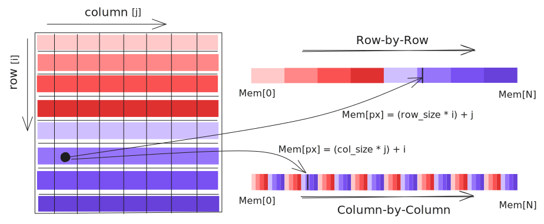

# **What is an image?**

Matthew Bryan
*CEA-Leti, Grenoble, France*
[matthew.bryan@cea.fr](mailto:matthew.bryan@cea.fr)
GitHub: [@matbryan52](https://github.com/matbryan52)

---
<!-- paginate: true -->

# Preamble

Microscopy lets us see, for a time

An image lets us look again

---
<!-- _class: columns2 -->

# Who I am

Matthew Bryan 
[@matbryan52](https://github.com/matbryan52) on GitHub

**Research Software Engineer** 
  Grenoble :fr:  Alps :mountain_snow:
 

Not really a Microscopist!
 

Background:

- chemical engineering
- image processing
- computer vision

---
<!-- _class: columns2 -->

# Content

- [Images and Photographs](#photographs-images)
- [Digital Images](#digital-images)
- Sampling
- Image visualisation
- Images and geometry
- Image filtering
- Image enhancement
- Image segmentation

---

<!-- _class: columns2 -->

  
# **Images and Photographs**

<figure>

<figcaption style="text-align: right; font-size: 16px"><a href="https://krvarshney.github.io">krvarshney.github.io</a></figcaption>
</figure>

---

## Images

Most generally, an Image is a visual representation of an object or scene

- In most contexts two-dimensional, though not only
- An image point in optics refers to the point where all light rays from a single point on an object intersect
- Recording the light along the plane of these intersection points forms a complete image of the object

---

####  Photography

Projection of focused light onto a surface has been known for millenia, but we lacked a reliable method to record the light until the early 1800s. (<a href="https://phydemo.app/ray-optics">phydemo.app</a>)
<!-- <figure>
<figcaption style="text-align: right; font-size: 16px"></figcaption> -->
<iframe src="https://phydemo.app/ray-optics/simulator/#XQAAAALBAwAAAAAAAABEKcrGU8hqLFnpmU9ERVKNO2ePj8XJTmUUQxTk4wzV-JNF7iYGUdpNImZrFI4NxHx54TObf8pGDW-uQ4iap450XQ9ZVVKbKtN20qJCDFJNe8-mqfMcT87wzYH9Ou79hCfVvnw4dhPOEuFF0Rx4r7BB7OZDCsU0PezMis4qwCmewxlKsoC9CM_odt0YKk_d-cAFhL0L3ZrUi53iJMnw9s0MJGjkLjam0Ix-joTjlCegfAvvhnzHwcEQeRzORinD_wddSLfyiobAMXi1jwiIhr6DL-aSP0XiuNABDRMNXIYLoTOOng3jGtlgmLU9w4rHaXx7HGw7YmcHCchyVxVuPzq5npRjjNU-YkEfZfqyOkHN_Y7r92UOtkiuEUg5vxBjPy227B_HecckbPwSRIsQjiSvGAjMlvYJBL9qpvZiUwTD2m_U5ZcoJno-4grK8JCsT7za9EO28ite3JT8BD_vYUxu7kbKRPIS_CGO9tr7M1dgU86eNbZrSuu-0wEEDRW18h0xzubHXkj6bIXYHrc90Z87N2NvwDfTavCRlQ5ch18BC0mtpSBBkkeIKRq9UbFUVnCaB81zLBcpzU0ukqR_W4Y7nfORg0_oqCS4ihrLphFoc2OlzEXiH1NMdcPFbN__3FksYg" width="1100px" height="450px" frameBorder="0"></iframe>

---

##  Analogue images - Film

<!-- _class: columns2 -->

Recording light in chemical reactions

- Light- (or electron-) sensitive coatings that transform when *exposed*
- Sensitivity determined by (chemical) reaction rate (temperature, wavelength etc.)
- "Resolution" determined by average particle size - randomly distributed!
  - In practice film is extremely densely coated

Micrograph of film grain
<figure>
<iframe src="http://localhost:9091/film-particles" width="560" height="450" frameBorder="0"></iframe>
<figcaption style="text-align: right; font-size: 20px"><a href="https://www.photomacrography.net/forum/viewtopic.php?t=26857">photomacrography.net</a></figcaption>
</figure>

---

##  Analogue images (Aside)

Any light-reacting chemistry could record a photograph, even photosynthesis

<figure>
<figcaption style="text-align: right; font-size: 20px"><a href="https://www.youtube.com/watch?v=-qETedzsFIE">YouTube @AppliedScience</a></figcaption>

  
   

</figure>

---

## Digital images

Recording light with numbers

- Measure local intensity electrically (conversion to charge, voltage), then *digitize* the analog signal to a numerical value
- Discrete sampling of the wavefront, usually onto a 2D grid
- At the most basic, a digital image is a list of numbers representing recorded *values*, and a way to structure these numbers into a shape we can interpret

---

## Rays to Image

---

## Pixels

A *pixel* is an **el**ement of a **pi**cture

- Represents a single intensity from the wavefront that was recorded

By extension, a *voxel* is an **el**ement of a **vo**lume, in 3D

---

## Image calibrations

Digital images are discrete, both in space and value

- Position within a digital image is via index coordinate like `[3, 5]`, not dimension `[0.2 cm, 0.8 cm]`.
- Intensity is typically recorded as an integer value like `530`, not a physical quantity like $3.2\: W\cdot m^{-2}$

Interpretation of digital images in physical units requires a *calibration*, accounting for (amongst others):

- Pixel size, spacing, shape
- Sensor response, readout characteristics

---

<!-- _class: columns2 -->

## Colour images

A colour image is a set of images of the same wavefront, each sampling part of the full spectrum.

- We are most familiar with RedGreenBlue (RGB) images
- These are usually made with a pre-sensor Bayer filter, which samples colour differently in adjacent pixels
- The values from pixels are split into R, G, and B intensity images.
- The three signals are spatially offset

When recombined intelligently, most images are represented without any artifacts, despite the offset

<figure>

<figcaption style="text-align: right; font-size: 16px"><a href="https://en.wikipedia.org/wiki/Bayer_filter#/media/File:Bayer_pattern_on_sensor.svg">Bayer-filter, Wiki - Cburnett</a></figcaption>
</figure>

---

## Spectral images

These are a logical extension of colour images, where each sub-image or *channel* represents a well-defined band of wavelength or energy.
- In contrast to colour images, spectral channels don't typically overlap in energy
- We usually cannot sample both spatially and spectrally simultenously, so we either create images channel-by-channel (EFTEM), or position-by-position (STEM-EELS)

---

<iframe src="https://phydemo.app/ray-optics/simulator/#XQAAAAJ3BAAAAAAAAABFqcrGU8hqLFnpmU9ERVKNPZUF_UC06pYFGJ1gc_njnHAQ6BXGzId4JbUgUJrFgoJPTEfFuZOf0bY8BwMqBZV8NrKKRSvAA9m43y39zcRl8lCzeUCyA3x4JnD674GPMtaoWVPEsjpMieHf5R7ApLoHn4OT8kVTDY_qbD8TnXNH001ocSc0CuNO4GUNRfg3-TXXvciAO7U4VXCmTBlKekTTHeZ7v9qpXgVE3_3P5izYztOABQ9ckBVyf0aRCV3Fxaw8iNtxBKTec7AoIRcS6A0Gao83hicekSdKAwwKEPRMEfv7yz6z0npCdqa05f_ldJ2sD9zAmePmysK6CDqseNMJzsZVj9Yi81Q9s6g-U4anGUhpb5SOYLmlrTX5WLNHeozEso50HhMbmuzgOkrGt0iZPCl8qv8R0Xi5_j9zO4QxiramoGqakP2EGKBo_6mC0h-jlUWS3sDpH77QS3xAG9raZWWFIK3ZoTV_z5_hnB-bujE-nFa4DGaUwB5GvejlwA9HpvDZGrfDuxKL-vAa5YaJ3PeklKyimXGLK5tMqg3KgtcpyS2wF8Q0Gsi4HitjNOMMKCTt6U0bICx4vJ3SROXOgT254PoUDTqj4Q1nXBbJuCTnKA8j8bJsVEBhie1Q3c7G-WSytXp046csH6mnwcW6IvoWXD4f5wLwPcllUrHFjyqhzsO6JCZqZhPC9yf3GnkKrSciS-0NCPZyOCzA42B6wNb0I9sIAzRcrw2oZuuM6RSrfM0tyRKlkwvTGWCky63zIgu9g4396i4sowkpFR93FrP-w1Crem3TqntFxxgxOkKOs-HvoC2J01hhmuQnvLcrDsJkubZ9XCnFVmMsKA9PXaYpuFbA4pR02lToD8l0J6n38__o_I8o" style="position:fixed; top:5%; left:5%; width:90%; height:90%; border:none; margin:0; padding:0; overflow:hidden; z-index:999999;"></iframe>

---

# **Images as digital information**

---

## Arrays of numbers

Computers store numbers as sequences of binary digits, which we interpret according to convention.

- An image is no more than a 1D list of numbers to a computer, there is no intrinsic 2D data structure in a computer's memory.
- The 1D data can be ordered row-by-row, or column-by-column, according to hardware and convention
  - This has implications for processing, as memory is **slow** - reading a whole row could be much faster than reading a whole column, or vice-versa.

---

## Memory layout

This becomes very important for >2D data, it pays to store data in a way which
matches the processing being done (whole images, or one pixel from many images?).

---

## Number types

There are many conventions for storing numbers, here are some common ones in images:

|                  | Name      | Size (bits) | Min          | Max        | Example usage |
| ---------------- | --------- | ----------- | ------------ | ---------- | ---------- |
| Binary           | `bool`      | 8           | 0            | 1          | Masking pixels |
| Unsigned Integer | `uint8`     | 8           | 0            | 255        | Raw data |
|                  | `uint16`    | 16          | 0            | 65,535      | Raw data |
| Integer          | `int16`     | 16          | \-32,768      | 32,767      | Background-subtraction |
|                  | `int32`     | 32          | \-2,147,483,648 | 2,147,483,647 | Computation |
| Floating         | `float32`   | 32          | \-3.40E+38   | \-3.40E+38 | Computation |
|                  | `float64`   | 64          | \-1.70E+308  | 1.70E+308  | Computation |
| Complex          | `complex64` | 64          | \-3.40E+38   | \-3.40E+38 | Waves, FFT |

---

## Number types - Uses

Most camera sensors generate raw data as unsigned integers (8-, 16- or more bits). When we begin to transform raw data we usually need to convert its type to hold our results correctly.

---

## Number types - Notes

- Digital numbers are stored in a fixed amount of space - exceeding the min or max for a type can cause "wrapping", e.g. `200_uint8 + 100_uint8 = 44_uint8`.
  - The range for `uint8` is 256, so `200 + 100 = 300` becomes `300 mod 256 = 44`.
* The size of the number is the space it requires in memory, and on disk
  - Often the larger the number type, the slower operations with that type are
* Floating point numbers have variable precision, i.e. they can represent very large or very small values, but are poor when trying to represent both at once
  - For example `324,000 + 0.0055 = 324,000` not `324,000.0055`
  - Be careful with electron wavelength and camera lengths!
* Complex numbers are stored as a pair of floating numbers representing real and imaginary parts, there is no native complex number format

---

## Image math

<iframe src="http://localhost:9091/image-math" width="1150" height="700" frameBorder="0"></iframe>

---

## Multi-image data, stacks, 4D-STEM

We think of images as 2D, but there are many forms of higher-dimensional images

- We have already mentioned spectral (or colour) images, these are usually 3D with shape `[spectral_channel, height, width]`.
* Similar is a time-series or multi-exposure image stack, e.g. `[time, height, width]`.
* 4D-STEM can be treated as an image, `[scan_y, scan_x, height, width]`
* Tomography acquisitions can an add an extra `[tilt]` dimension to the above!

---

## Multi-image data, stacks, 4D-STEM

---

<!-- _class: columns2 -->

## Sparse images

In very low dose conditions (or with EDX), most image pixels contain a zero value. This is good use case for *sparse* images.

- Store only non-zero values
- Can achieve enormous space saving
- Many operations `f(a, 0) == {0, a}` so remove wasted computation
- Simplest strategy is store coordinates + values, but more intelligent schemes exist (e.g. CSR)

---

- File formats (PNG, tiff, jpeg, proprietary formats), compression, encoding, headers
- Useful tools to work with images
- Useful libraries to load images in Python (Dask?)
- Conventions for coordinate systems

---

# Visualising images

- Colourmaps, perceptual uniformity :smile:
- Colour spaces, alpha
- Brightness, Contrast, Gamma, Logarithmic colour
- Complex images and representations
- Phase unwrapping / periodicity in images

---

# Images and sampling

- Pixel size (all rays down to one point)
- Sampling (nyquist limit etc)
- Fourier transforms of images, aliasing
- Moirés
- Image interpolation
- "Sub-pixel" methods / upsampling

---

# Geometric transforms of images

- Hierarchy up to affine
- Non-affine transforms
- Polar transforms
- Distortion correction

---

# Image filters

- 2D Convolution as a process
- Simple filters (blur, edge)
- Non-convolutional filters (median etc)
- Filtering of images in frequency space
  - Clean power spectrum
  - Low-pass, High-pass
  - Selective Bragg filter
  -

---

# Image segmentation

- Thresholding (auto-threshold detection)
- Operations on binary images (erode, dilate etc)
- Labelled images, measures on labelled regions
- Basic segmentation algorithms
- "Machine learning" segmentation

---

# Image alignment / pattern matching

- Image correlation / autocorrelation
- Common alignment tools and approaches
- Image difference metrics

---

# Image restoration

- Denoising
  - BM(3D), Noise2Noise etc
- Inpainting

---

# Extra topics

A bit more physics ??

- PSF
- STEM scan patterns ?
- GPA
- Phase Reconstruction (holo etc)
