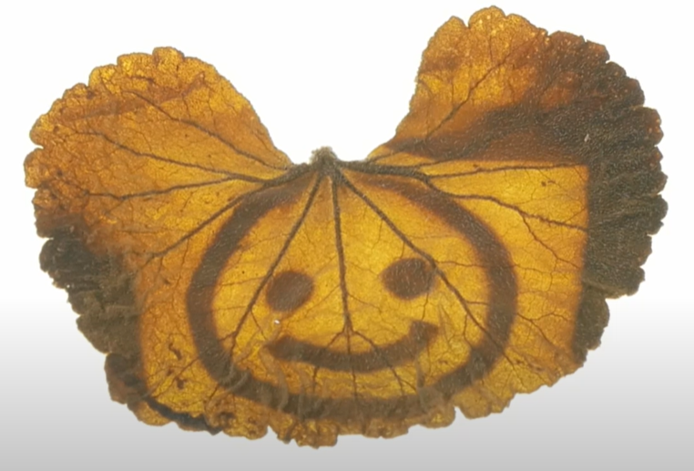
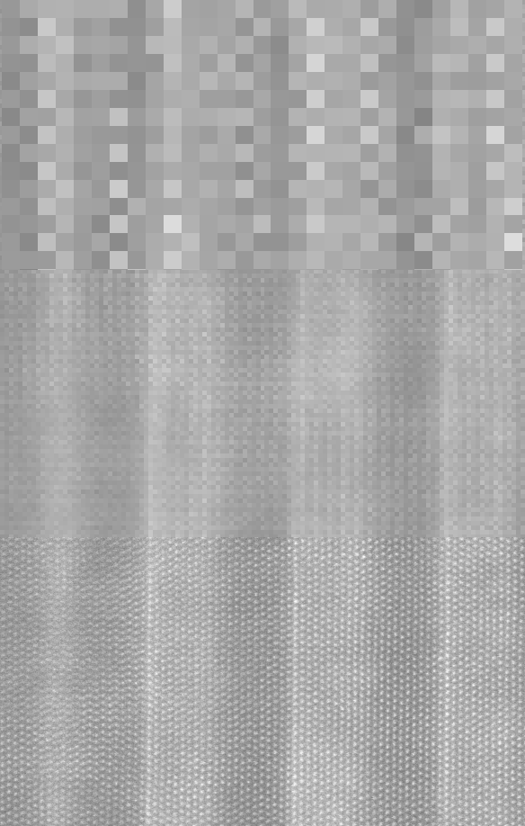
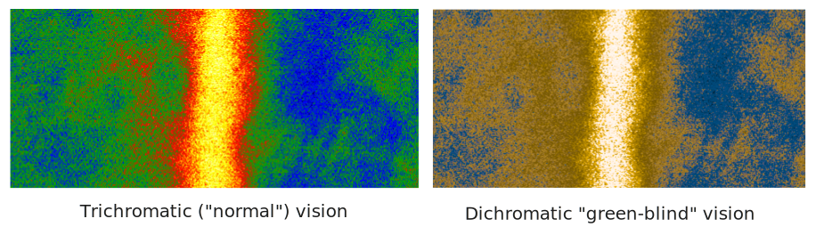

# **What is an image?**

Matthew Bryan
*CEA-Leti, Grenoble, France*
[matthew.bryan@cea.fr](mailto:matthew.bryan@cea.fr)
GitHub: [@matbryan52](https://github.com/matbryan52)

---
<!-- paginate: true -->

# Preamble

Microscopy lets us see, for a time

<hr>

An image lets us look again

---
<!-- _class: columns2 -->
<style scoped>
/* Set the image and text to inline elements */
img, span {
    display: inline;
    vertical-align: middle;
}
</style>
# Who I am

Matthew Bryan<br />
[@matbryan52](https://github.com/matbryan52) on GitHub


**Research Software Engineer**<br />
  Grenoble :fr:  Alps :mountain_snow:
<br>

Not really a Microscopist!
<br>

Background:

- chemical engineering
- image processing
- computer vision

---
<!-- _class: columns2 -->
<style scoped>

h1 {
  column-span: all;
}

</style>
# Content

- [Images and Photographs](#photographs-images)
- [Digital Images](#digital-images)
- [Image visualisation](#visualising-images)
- [Images as signals](#sampling)
- [Images and geometry](#transforms)
- [Image filtering](#filtering)
- [Image segmentation](#segmentation)
- [Image enhancement](#restoration)
- [Image alignment](#alignment)

---

<!-- _class: columns2 -->

<a name='photographs-images'></a>

<br/><br/>
# **Images and Photographs**

<figure>

<figcaption style="text-align: right; font-size: 16px"><a href="https://krvarshney.github.io">krvarshney.github.io</a></figcaption>
</figure>

---

## Images

Most generally, an Image is a visual representation of an object or scene

- In most contexts two-dimensional, though not only
- An image point in optics refers to the point where all light rays from a single point on an object intersect
- Recording the light along the plane of these intersection points forms a complete image of the object

---

####  Photography

Projection of focused light onto a surface has been known for millenia, but we lacked a reliable method to record the light until the early 1800s. (<a href="https://phydemo.app/ray-optics">phydemo.app</a>)
<!-- <figure>
<figcaption style="text-align: right; font-size: 16px"></figcaption> -->
<iframe src="https://phydemo.app/ray-optics/simulator/#XQAAAALBAwAAAAAAAABEKcrGU8hqLFnpmU9ERVKNO2ePj8XJTmUUQxTk4wzV-JNF7iYGUdpNImZrFI4NxHx54TObf8pGDW-uQ4iap450XQ9ZVVKbKtN20qJCDFJNe8-mqfMcT87wzYH9Ou79hCfVvnw4dhPOEuFF0Rx4r7BB7OZDCsU0PezMis4qwCmewxlKsoC9CM_odt0YKk_d-cAFhL0L3ZrUi53iJMnw9s0MJGjkLjam0Ix-joTjlCegfAvvhnzHwcEQeRzORinD_wddSLfyiobAMXi1jwiIhr6DL-aSP0XiuNABDRMNXIYLoTOOng3jGtlgmLU9w4rHaXx7HGw7YmcHCchyVxVuPzq5npRjjNU-YkEfZfqyOkHN_Y7r92UOtkiuEUg5vxBjPy227B_HecckbPwSRIsQjiSvGAjMlvYJBL9qpvZiUwTD2m_U5ZcoJno-4grK8JCsT7za9EO28ite3JT8BD_vYUxu7kbKRPIS_CGO9tr7M1dgU86eNbZrSuu-0wEEDRW18h0xzubHXkj6bIXYHrc90Z87N2NvwDfTavCRlQ5ch18BC0mtpSBBkkeIKRq9UbFUVnCaB81zLBcpzU0ukqR_W4Y7nfORg0_oqCS4ihrLphFoc2OlzEXiH1NMdcPFbN__3FksYg" width="1100px" height="450px" frameBorder="0"></iframe>

---

##  Analogue images - Film

<!-- _class: columns2 -->

Recording light in chemical reactions

- Light- (or electron-) sensitive coatings that transform when *exposed*
- Sensitivity determined by (chemical) reaction rate (temperature, wavelength etc.)
- "Resolution" determined by average particle size - randomly distributed!
  - In practice film is extremely densely coated

<span style="text-align: right">Micrograph of film grain</span>
<figure>
<iframe src="http://localhost:9091/film-particles" width="560" height="450" frameBorder="0"></iframe>
<figcaption style="text-align: right; font-size: 20px"><a href="https://www.photomacrography.net/forum/viewtopic.php?t=26857">photomacrography.net</a></figcaption>
</figure>

---

##  Analogue images (Aside)

Any light-reacting chemistry could record a photograph, even photosynthesis

<figure>
<figcaption style="text-align: right; font-size: 20px"><a href="https://www.youtube.com/watch?v=-qETedzsFIE">YouTube @AppliedScience</a></figcaption>
<p float="left">
  
   
</p>
</figure>

---

## Digital images

Recording light with numbers

- Measure local intensity electrically (conversion to charge, voltage), then *digitize* the analog signal to a numerical value
- Discrete sampling of the wavefront, usually onto a 2D grid
- At the most basic, a digital image is a list of numbers representing recorded *values*, and a way to structure these numbers into a shape we can interpret

---

## Rays to Image


---

## Pixels

A *pixel* is an **el**ement of a **pi**cture

- Represents a single intensity from the wavefront that was recorded

By extension, a *voxel* is an **el**ement of a **vo**lume, in 3D

---

## Image calibrations

Digital images are discrete, both in space and value

- Position within a digital image is via index coordinate like `[3, 5]`, not dimension `[0.2 cm, 0.8 cm]`.
- Intensity is typically recorded as an integer value like `530`, not a physical quantity like $3.2\: W\cdot m^{-2}$

Interpretation of digital images in physical units requires a *calibration*, accounting for (amongst others):

- Pixel size, spacing, shape
- Sensor response, readout characteristics


---

<!-- _class: columns2 -->

<style scoped>h2 { position: absolute; top: 5%; }</style>

## Colour images

A colour image is a set of images of the same wavefront, each sampling part of the full spectrum.

- We are most familiar with <span style="color:red">Red</span><span style="color:green">Green</span><span style="color:blue">Blue</span> (<span style="color:red">R</span><span style="color:green">G</span><span style="color:blue">B</span>) images
- These are usually made with a pre-sensor Bayer filter, which samples colour differently in adjacent pixels
- The values from pixels are split into <span style="color:red">R</span>, <span style="color:green">G</span>, and <span style="color:blue">B</span> intensity images.
- The three signals are spatially offset

When recombined intelligently, most images are represented without any artifacts, despite the offset

<figure>

<figcaption style="text-align: right; font-size: 16px"><a href="https://en.wikipedia.org/wiki/Bayer_filter#/media/File:Bayer_pattern_on_sensor.svg">Bayer-filter, Wiki - Cburnett</a></figcaption>
</figure>

---

## Spectral images

These are a logical extension of colour images, where each sub-image or *channel* represents a well-defined band of wavelength or energy.
- In contrast to colour images, spectral channels don't typically overlap in energy
- We usually cannot sample both spatially and spectrally simultenously, so we either create images channel-by-channel (EFTEM), or position-by-position (STEM-EELS)

---

<iframe src="https://phydemo.app/ray-optics/simulator/#XQAAAAJ3BAAAAAAAAABFqcrGU8hqLFnpmU9ERVKNPZUF_UC06pYFGJ1gc_njnHAQ6BXGzId4JbUgUJrFgoJPTEfFuZOf0bY8BwMqBZV8NrKKRSvAA9m43y39zcRl8lCzeUCyA3x4JnD674GPMtaoWVPEsjpMieHf5R7ApLoHn4OT8kVTDY_qbD8TnXNH001ocSc0CuNO4GUNRfg3-TXXvciAO7U4VXCmTBlKekTTHeZ7v9qpXgVE3_3P5izYztOABQ9ckBVyf0aRCV3Fxaw8iNtxBKTec7AoIRcS6A0Gao83hicekSdKAwwKEPRMEfv7yz6z0npCdqa05f_ldJ2sD9zAmePmysK6CDqseNMJzsZVj9Yi81Q9s6g-U4anGUhpb5SOYLmlrTX5WLNHeozEso50HhMbmuzgOkrGt0iZPCl8qv8R0Xi5_j9zO4QxiramoGqakP2EGKBo_6mC0h-jlUWS3sDpH77QS3xAG9raZWWFIK3ZoTV_z5_hnB-bujE-nFa4DGaUwB5GvejlwA9HpvDZGrfDuxKL-vAa5YaJ3PeklKyimXGLK5tMqg3KgtcpyS2wF8Q0Gsi4HitjNOMMKCTt6U0bICx4vJ3SROXOgT254PoUDTqj4Q1nXBbJuCTnKA8j8bJsVEBhie1Q3c7G-WSytXp046csH6mnwcW6IvoWXD4f5wLwPcllUrHFjyqhzsO6JCZqZhPC9yf3GnkKrSciS-0NCPZyOCzA42B6wNb0I9sIAzRcrw2oZuuM6RSrfM0tyRKlkwvTGWCky63zIgu9g4396i4sowkpFR93FrP-w1Crem3TqntFxxgxOkKOs-HvoC2J01hhmuQnvLcrDsJkubZ9XCnFVmMsKA9PXaYpuFbA4pR02lToD8l0J6n38__o_I8o" style="position:fixed; top:5%; left:5%; width:90%; height:90%; border:none; margin:0; padding:0; overflow:hidden; z-index:999999;"></iframe>

---

<a name='digital-images'></a>

# **Images as digital information**



---

## Arrays of numbers

Computers store numbers as sequences of binary digits, which we interpret according to convention.

- An image is no more than a 1D list of numbers to a computer, there is no intrinsic 2D data structure in a computer's memory.
- The 1D data can be ordered row-by-row, or column-by-column, according to hardware and convention
  - This has implications for processing, as memory is **slow** - reading a whole row could be much faster than reading a whole column, or vice-versa.

---

<style scoped>h2 { position: absolute; top: 5%; }</style>

## Memory layout


This becomes very important for >2D data, it pays to store data in a way which
matches the processing being done (whole images, or one pixel from many images?).

---

<style scoped>
table {
  font-size: 20px;
}
</style>
## Number types

There are many conventions for storing numbers, here are some common ones in images:

|                  | Name      | Size (bits) | Min          | Max        | Example usage |
| ---------------- | --------- | ----------- | ------------ | ---------- | ---------- |
| Binary           | `bool`      | 8           | 0            | 1          | Masking pixels |
| Unsigned Integer | `uint8`     | 8           | 0            | 255        | Raw data |
|                  | `uint16`    | 16          | 0            | 65,535      | Raw data |
| Integer          | `int16`     | 16          | \-32,768      | 32,767      | Background-subtraction |
|                  | `int32`     | 32          | \-2,147,483,648 | 2,147,483,647 | Computation |
| Floating         | `float32`   | 32          | \-3.40E+38   | \-3.40E+38 | Computation |
|                  | `float64`   | 64          | \-1.70E+308  | 1.70E+308  | Computation |
| Complex          | `complex64` | 64          | \-3.40E+38   | \-3.40E+38 | Waves, FFT |

---

## Number types - Uses

Most camera sensors generate raw data as unsigned integers (8-, 16- or more bits). When we begin to transform raw data we usually need to convert its type to hold our results correctly.

---

## Number types - Notes

- Digital numbers are stored in a fixed amount of space - exceeding the min or max for a type can cause "wrapping", e.g. `200_uint8 + 100_uint8 = 44_uint8`.
  - The range for `uint8` is 256, so `200 + 100 = 300` becomes `300 mod 256 = 44`.
* The size of the number is the space it requires in memory, and on disk
  - Often the larger the number type, the slower operations with that type are
* Floating point numbers have variable precision, i.e. they can represent very large or very small values, but are poor when trying to represent both at once
  - For example `324,000 + 0.0055 = 324,000` not `324,000.0055`
  - Be careful with electron wavelength and camera lengths!
* Complex numbers are stored as a pair of floating numbers representing real and imaginary parts, there is no native complex number format

---

<style scoped>h2 { position: absolute; top: 5%; }</style>
## Maths with images

<iframe src="http://localhost:9091/image-math" width="1150" height="700" frameBorder="0"></iframe>

---

## Coordinate system conventions

Depending on the tool or language you use, image coordinate systems can vary

- Most use matrix notation for indexing `[row, column]`
* Python and C-inspired languages are **0-indexed**
  - i.e. `image[5, 3]` means "6th row, 4rd column"
* MATLAB is **1-indexed**:
  - `image[5, 3]` means "5th row, 3rd column"
* Most place `y == 0` at the "top" when displayed, with positive "down"
  - This matches matrix notation, but is opposite to convention for axes / graphs
  - Implies a change of direction for rotations (clockwise not anticlockwise!)

---

## Multi-image data, stacks, 4D-STEM


Tomography acquisitions can an add an extra `[tilt]` dimension to the above!

---

<!-- _class: columns2 -->

## Sparse images

In very low dose conditions (or with EDX), most image pixels contain a zero value. This is good use case for *sparse* images.

- Store only non-zero values
- Can achieve enormous space saving
- Many operations `f(a, 0) == {0, a}` so remove wasted computation
- Simplest strategy is store coordinates + values, but more intelligent schemes exist (e.g. CSR)


---

## Image file formats

Images can be stored in many ways, depending on how they are used

- `.jpg`, `.png`, `.gif`: colour RGB `uint8` images, compressed for small file size, open anywhere without special software, not for raw data
* `.tif`: a general-purpose image format, can hold most number types and shapes
  - TIFF files with strange data (floating point) may need special software
  - Can hold additional metadata (e.g. calibrations), can be compressed
* Proprietary formats like `.dm3/4`, `.mib`, `.emd`, `.blo`: specific to a certain camera or software, not always readable elsewhere
* General *array* formats: `.mat`, `.npy`, `.hdf5`, `.zarr`: flexible, can be compressed, can hold stacks / nD data and metadata, need compatible code/software

---

## Image software

Useful software packages to work with images in microscopy

---

<style scoped>h3 { position: absolute; top: 3%; }</style>

<!-- _class: columns2 -->
### Fiji ([imagej.net](https://imagej.net/software/fiji/))

Widely used in scientific imaging, many plugins


Calibrations, stacks, measurements, math, segmentation...


---

<style scoped>h3 { position: absolute; top: 7%; }</style>

<!-- _class: columns2 -->
### Napari ([napari.org](https://napari.org/))
Multi-D data viewer, annotations

Python-based, easy to add analysis


Good support for 3D volumes

---

<style scoped>
img[alt~="center"] {
  display: block;
  margin: 0 auto;
}
</style>

### Gatan Digital Micrograph ([gatan.com](https://www.gatan.com/installation-instructions))
Well-known, feature-rich GUI even when using the free license

Python scripting enables any analysis with GMS display


---

## Python tools for images

The Python scientific ecosystem is vast - once an image is loaded as array data, typically under `numpy`, it can be interpreted in myriad ways

---

`scipy-ndimage` ([docs.scipy.org](https://docs.scipy.org/doc/scipy/reference/ndimage.html))

- Low-level tools for images (e.g. convolve, interpolate, measurements)

`scikit-image` / `skimage` ([scikit-image.org](https://scikit-image.org/))

- High-level tools for images (e.g. resizing, alignment, segmentation, filtering)


---
<!-- _class: columns2 -->

`Pillow` \[Python Imaging Library\] ([pillow.readthedocs.io](https://pillow.readthedocs.io/en/stable/))

- Graphics-focused, colour images, drawing, compositing

```python
# Pillow imports as PIL
from PIL import Image, ImageDraw

image = Image.open("image.png")
draw = ImageDraw.Draw(image)
draw.text((50, 50), "Text")
```
<br>

`imageio` ([imageio.readthedocs.io](https://imageio.readthedocs.io/en/stable/))

- Reading and writing many image formats and videos

```python
import imageio.v3 as iio

frames = np.stack(
  [iio.imread(f"{x}.jpg") for x in range(n)],
)
iio.imwrite("test.gif", frames, fps=10)
```

---

`matplotlib` ([matplotlib.org](https://matplotlib.org/stable/))

- General plotting library, but will `load` images, or display them on axes
- Good for combining images with results + annotations


---

<a name='visualising-images'></a>

# **Visualising images**


---

## Data → Screen colour

Scientific cameras produce images of intensity as unsigned integers, typically, and screens display `uint8` RGB colour (24-bit colour). This requires us to map from data to screen for display.

- <span style="color:red">R</span> = <span style="color:green">G</span> = <span style="color:blue">B</span> in a colour image displays as colourless **Grey**
  - Screens can only display 256 levels of pure grey intensity
  - If the data are more than 8-bit, need to sacrifice detail or clip the data range
- We can use artificial colour to achieve more on-screen contrast, known as a *lookup table* or *colormap*, of which there are many choices for different applications.

The choice of colormap or data transformation for display can massively influence how the data are perceived.

---
<!-- <style scoped>h3 { position: absolute; top: 3%; }</style> -->
### Brightness + Contrast
<iframe src="http://localhost:9091/colour-map" width="1150" height="600" frameBorder="0"></iframe>

<!-- Interactive figure of brightness, contrast, clip, gamma transform

Maybe a coloured line / scatter plot of the mapping ?

Interactive colourmap figure with some symmetric data, too -->

---

## Dynamic range

In microscopy we frequently see data which span many orders of magnitude in intesity, with detail at both the low and high-ends (e.g. diffraction patterns).

A non-linear transform between data and colour can be used to bridge the gap, trading local for global contrast.

- Logarithmic colour colours data by order of intensity magnitude:
    - $I_{disp} = \log (I_{img})$
- Gamma-based colour scales the data with a power law before display:
    - $I_{disp} = I_{img}^\gamma$

---

### Gamma + Logarithmic colour

<iframe src="http://localhost:9091/gamma-log" width="1150" height="650" frameBorder="0"></iframe>

---

## Perceptual uniformity

Colourmaps are critical to how we interpret visual data. It is important to recognize
when a feature we see is from the data or from the map.

- Perceptually uniformity means a $\Delta$ in the data displays as the same *visual* $\Delta$ to our eyes, no matter where in the range of mapped values it is
  - No one range of values changes "faster" than another
- Non-uniform colourmaps can create visual boundaries which do not exist in the data, or hide true boundaries.

This is a well-studied problem, and uniform colourmaps are available for many applications. See the [colorcet.holoviz.org](https://colorcet.holoviz.org/) page or [Kovesi (2015)](https://arxiv.org/pdf/1509.03700) for good examples.

---

## Perceptual uniformity

The visualisation is of a linear ramp with a sinusoidal comb superimposed. The comb perturbs the intensity slightly up/down, so if the comb is visible then the colourmap is capable of representing small value changes in this part of its range.

<iframe src="http://localhost:9091/colour-uniformity" width="1150" height="280" frameBorder="0"></iframe>

If any part of the comb is invisible, then the colourmap is nonuniform. If any other patterns are visible then it is *highly* nonuniform!

---
<style scoped>
img[alt~="center"] {
  display: block;
  margin: 0 auto;
}
</style>
## Colour blindness

Certain colour blindness forms are experienced in 1-5% of the population (biased towards males). Choice of colourmap can hugely impact the perception of data for these populations.

- In particular try to *avoid* using <span style="color:red">Red</span>–<span style="color:green">Green</span> to draw distinctions

[davidmathlogic.com/colorblind](https://davidmathlogic.com/colorblind) is a simple overview.



---
<!-- _class: columns2 -->
## Transparency (Alpha)

Digital images can also be combined using transparency, often called *alpha*. This allows overlaying one information atop another.

Transparency can be defined on a per-pixel basis to convey information like density.

In colour images this is referred to as `RGBA` where `A` acts as a 4th colour channel.

<iframe src="http://localhost:9091/transparency" width="650" height="600" frameBorder="0"></iframe>

---

## Complex and 2D-vector images

For complex images we must choose how convert real + imaginary into an intensity image.

- A typical example in microscopy is electron holography, where the reconstructed wavefront is complex
  - The `abs()` of the wave represents the amplitude
  - The `angle()` of the wave displays the phase
- We also need to be careful about how to display periodic phase with a colourmap, and can use a *cyclic* map display to acheive this, though we lose visualisation of phase ramps.
<!-- phase unwrapping -->

---

<iframe src="http://localhost:9091/complex-image" width="1150" height="650" frameBorder="0"></iframe>

---

<a name='sampling'></a>

# **Images as signals**


---

# Images as signals

An digital image samples a continuous world onto a discrete grid. The step- or *pixel size* limits what information can ever be captured by the image.

Conversely, more pixel density only adds value if the information is there to sample:

* A smooth ramp in intensity is fully defined by two points - we can *interpolate* and get the same result as a densely sampled image
* If the optics of the microscope cannot cleanly resolve the detail we want to see, more camera pixels will not help.
* For a periodic feature (*atomic columns?*) 2 samples per shortest period are sufficient according to Nyqist-Shannon, but 4+ is more convincing.

---
<style scoped>
img[alt~="center"] {
  display: block;
  margin: 0 auto;
}
</style>

With reduced sampling, the faster-changing areas of the signal are not resolved.


With extra sampling, no additional detail is added

---
<style scoped>
img[alt~="top-right"] {
  position: absolute;
  top: 0px;
  right: 0px;
  height: 225px;
}
</style>

# Frequencies in 2D signals


In 1D we can perform a Fourier *transform* to describe a function $f(x)$ as a sum of periodic components each $A_ue^{-\mathrm{i} 2\pi u x}$ i.e. $A_u\cos(2\pi u x +\theta) + \mathrm{i}A_u\sin(2\pi u x)$, for which we can evaluate the coefficients $A_u$:

$$
A_u = \int_{-\infty}^{\infty} f(x)\ e^{-\mathrm{i} 2\pi u x}\,dx, \quad \forall u \in \mathbb{R}
$$

each $A_u$ represents a contribution to the description of $f(x)$ by a particular *frequency* $u$.

On an image $f(x, y)$ we can do the same, but we must describe two *spatial frequencies* e.g. $u, v$, which are aligned with $x, y$.

---

## Image Fourier Transform

NEED A BETTER INTRO TO FREQUENCY IMAGES HERE

<iframe src="http://localhost:9091/fourier-image" width="1150" height="650" frameBorder="0"></iframe>

---
<style scoped>
img[alt~="center"] {
  display: block;
  margin: 0 auto;
}
</style>


---

## Uses of image Fourier transforms

- The transform is reversible, it contains exactly the same information as the image
* It can be computed quickly with Fast Fourier Transform (**FFT**)
* Representing the image as frequency components allows us to performing *filtering*, e.g. remove high-frequency noise while leaving the main content intact
* Many mathematical operations are much more efficient in frequency space than direct space, for example correlation and convolution

---

## Fourier transforms in Microscopy

- High-resolution images of atomic columns are naturally periodic, and lattice spacings appear clearly in the amplitude of an FFT.
* Electron holography extracts the complex transmission function of the sample from the FFT of the interference between the known reference wavefront and that passing through the sample.
* Geometric Phase Analysis (GPA) extracts lattice strain from analysis of the phase of peaks in the FFT of a high-resolution image.

---

## Image interpolation

A discrete image can be *interpolated* into a continuous coordinate system so that it can be *re-sampled* at new coordinates.

* Interpolation does not add additional information, but can reconstruct a higher-fidelity version of the image if we have a good model of the true signal.
* Interpolating schemes can be very basic (e.g. bi-linear between adjacent pixels) or very flexible (polynomial splines) and take into account a wider region when interpolating locally.
* Interpolation is one method to acheive *sub-pixel* resolution in measurements, for example finding the position of intensity peaks in an image.

---

## Interpolated line profile from image

<iframe src="http://localhost:9091/interpolation-sampling" width="1150" height="650" frameBorder="0"></iframe>

---
<style scoped>h2 { position: absolute; top: 5%; }</style>
## Aliasing

A signal sampled at a rate less than its highest frequency content can be subject to *aliasing*. The samples can ambiguously fit both the true signal and many other signals at combinations of the true and sampling frequency.

<iframe src="http://localhost:9091/aliasing" width="1150" height="550" frameBorder="0"></iframe>

---

## Moiré patterns

A moiré pattern is a form of interference (constructive and destructive) between two periodic signals, or between a signal and a sampling rate.

It is a form of aliasing in that the pattern is a product to the two characteristic frequencies.


---

## Moirés in microscopy

Moiré imaging in microscopy is the intentional undersampling of a periodic structure, e.g. a lattice, to record a lower-frequency alias.

The alias still represents the lattice, but each period in the alias covers multiple periods in the true signal. This allows us to see changes to the lattice from a larger field of view.

---

## Moirés in microscopy

<iframe src="http://localhost:9091/stem-moire" width="1350" height="750" frameBorder="0"></iframe>

---

<a name='transforms'></a>

# **Images and Geometry**


---
<style scoped>
img[alt~="center"] {
  display: block;
  margin: 0 auto;
}
</style>
# Geometric transforms of images

The information in an image exists on a coordinate grid. We can map the same data to a new grid using a *transform*


---
<style scoped>
img[alt~="center"] {
  display: block;
  margin: 0 auto;
}
</style>
## Resizing

The simplest transform is resizing → `(0, 0)` remains static, all other values are moved onto a larger or smaller grid

Missing values are added via *interpolation* (upscaling), multiple values are merged using *averaging* (downscaling)


---

## Matrix transforms

Uniform transformations can be represented as a matrix multiplication that applies to the coordinate grid. These can be chained arbitrarily to acheive a range of effects.

<br>

| $\begin{bmatrix}s_x & 0 & 0 \\0 & s_y & 0 \\0 & 0 & 1 \\\end{bmatrix}$ | $\begin{bmatrix}\cos{\theta} & -\sin{\theta} & 0 \\\sin{\theta} & \cos{\theta} & 0 \\0 & 0 & 1 \\\end{bmatrix}$ | $\begin{bmatrix}1 & 0 & 0 \\0 & -1 & 0 \\0 & 0 & 1 \\\end{bmatrix}$ | $\begin{bmatrix}1 & \lambda & 0 \\0 & 1 & 0 \\0 & 0 & 1 \\\end{bmatrix}$ | $\begin{bmatrix}1 & 0 & t_x \\0 & 1 & t_y \\0 & 0 & 1 \\\end{bmatrix}$ |
| :--------------: | :-------: | :---------: | :----------: | :--------: |
| Scaling $x$ + $y$ | Rotation by $\theta$ | Flip-$y$ | Shear $x$ | Shift $x$ + $y$ |

<br>

A uniform resize operation is the scaling matrix multiplication with $s_x = s_y$

---
<style scoped>h2 { position: absolute; top: 3%; }</style>
## Matrix transforms

<iframe src="http://localhost:9091/transform-affine" width="1150" height="650" frameBorder="0"></iframe>

---
<style scoped>h2 { position: absolute; top: 3%; }</style>
## Non-uniform transforms

When an imaging system is heavily distorted, a simple matrix transformation may not be enough. In this case a non-uniform transform can be applied to correct local displacements.

<iframe src="http://localhost:9091/transform-nonuniform" width="1150" height="600" frameBorder="0"></iframe>


---
<style scoped>h2 { position: absolute; top: 5%; }</style>
## Polar image transform

Some image signals, e.g. diffraction patterns, can be better-interpreted in polar coordinates $(r, \theta)$ rather than Cartesian $(x, y)$.

<iframe src="http://localhost:9091/warp-polar" width="1150" height="550" frameBorder="0"></iframe>

---

<a name='filtering'></a>

# **Image Filtering**


---
<style scoped>
img[alt~="center"] {
  display: block;
  margin: 0 auto;
}
</style>
# Filtering

Filters enhance certain information in an image, compensate for issues in the imaging system or highlight properties of the image which are beyond a simple intensity distribution.

In most cases filters change the value of any given pixel based on its neighbours, or on the population of all pixels in the image.


---
<style scoped>
img[alt~="center"] {
  display: block;
  margin: 0 auto;
}
</style>
<style scoped>h2 { position: absolute; top: 5%; }</style>

## Patch-based filters

The simplest type of filter is *patch-based*. These run a procedure in the vicinity of each pixel to generate a new value for that pixel.


Edges always need special treatment as their neighbourhood is limited, else the filtered image becomes smaller. Padding with zeros, periodic boundaries or reflecting the boundary are common ways to handle this.

<!-- Median filter? -->
---
<!-- _class: columns2 -->

## Convolution filters

Convolutional filters are a type of patch-based filter using elementwise multiplication and summation with a small *kernel* to compute each new pixel value.

They are equivalent to the convolution operation $a * b$, and so can be efficiently computed using a Fourier transform via $\hat{F}(a*b) = \hat{F}(a)\hat{F}(b)$.

The size and shape of the kernel's elements determines the range of the filter.
<figure>

<figcaption  style="text-align: right; font-size: 14px"><a href="https://arxiv.org/abs/1603.07285">Dumoulin and Visin (2016)</a></figcaption>
</figure>

---

## Convolution filters

<style scoped>
img[alt~="center"] {
  display: block;
  margin: 0 auto;
}
</style>


---
<style scoped>
img[alt~="center"] {
  display: block;
  margin: 0 auto;
}
</style>
## Edge filters (Sobel etc.)

Edge filters respond to sharp transitions in image intensity, or large image gradient, and are useful in applications like peak finding or contour detection for metrology.


The size of the filter influences how sharp an edge must be to be retained by the filter.

---

## Frequency space filtering

Zero-ing or modifying certain frequencies in the FFT of an image acts as a filtering process.

The most well-known are *low-pass*, *high-pass* and *band-pass* filters, which preserve low-, high- or a band- of frequencies.

---

## Frequency space filtering

<iframe src="http://localhost:9091/fourier-filtering" width="1150" height="550" frameBorder="0"></iframe>

<!-- --- -->
  <!-- - Clean power spectrum -->
  <!-- - Selective Bragg filter -->
---
<a name='segmentation'></a>

# **Image Segmentation**


---

# Image segmentation

Image segmentation algorithms label pixels of an image based on what they represent.

- Labelling phases of a poly-crystal based on orientation is a form of image segmentation, in order to measure a grain size distribution.

Segmentation algorithms can use local- and non-local information to label a pixel.


---

## Binary thresholding

The simplest segmentation is a hard cutoff in intensity, above the cutoff is assigned category `1` or `True`, below a `0` or `False`. For simple, good-contrast data this is often sufficient.

<iframe src="http://localhost:9091/thresholding" width="1100" height="450" frameBorder="0"></iframe>

---

## Theshold choice

The right cutoff depends on the data, its range, and the intended analysis.

Algorithms exist to automatically threshold an image, e.g. [Otsu's method](https://en.wikipedia.org/wiki/Otsu%27s_method), based on spliting the intensity histogram in a way which maximises variance.

---

## Binary image labelling

The *connected components* algorithm numbers isolated regions in a binary image, allowing us to then count and measure properties like area and dimension.

---

## Binary image operations

A binary image can be modified using *morphological operations*, which shrink or expand a region, or fill holes. Skeletonization reduces binary shapes to one pixel wide paths.

---

## Segmentation algorithms

When an image contains single regions with varying intensity or noise makes pixel-wise segmentation impossible, more advanced algorithms can use *features* of the image - edges, textures etc. - to group pixels together.

Maybe a demo of skimage `image_features` based segmentation (as done in ilastik ?). Might need to consider compute time on the laptop.

---

## Deep learning for image segmentation

Image segmentation was an early application of convolutional neural networks, as a natural extension of whole-image classification. Rather than compress all of the image information into a single category label, instead each pixel is classified individually taking into account local- and global- content.

The most well-know, intuitive, albeit now quite old architecture are the U-Nets, which are designed to preserve information from multiple image scales until the final classification layer.

---
<a name='restoration'></a>

# **Image Restoration**


---

# Image restoration

Image restoration is any technique to remove artefacts or noise from an image while preserving the content. In microscopy we frequently encounter low signal-to-noise data, especially in low-dose conditions, and so denoising in particular is of great interest.

---

## Binning

Many modern electron cameras are built with dense pixel arrays, and 2K or 4K images are not unusual. A simple approach to improve noisy data is to apply *binning*, i.e. sum or average the recorded intensity within non-overlapping patches. Ignoring complexities of detector physics, this is almost equivalent to a camera with larger but fewer pixels.

One small advantage is that sampling the intensity NxN times per-patch does give slightly improved statistics, not least we can estimate the deviation from the mean in each patch.

---

## Stacking

When acquisition condition allow, taking multiple rapid scans or images to form an *image stack* is also advantageous. In a similar way to binning we can compute statistics for each pixel, and exclude those which are clearly outliers. Experimentally, stacking can avoid problems such as sample drift during long acquisitions, leading to reduced distortion.

---

## Denoising

Denoising algorithms try to split an image into signal and noise components in order to suppress the latter more than the former. They are an important algorithmic tool to improve the performance of other techniques such as image alignment or segmentation.

---

## Denoising: PCA

Principal Component Analysis is a well-known tool to express data as a set of *components* of decreasing importance to re-create that data. Excluding lower-weighted components acts to exclude outliers and noise, since these only represent a small portion of the whole data. It is a matrix factorisation approach and so is very computationally intensive on large images, but can provide an easy way to de-noise a dataset.

---

## Denoising: Non-Local means

This algorithm performs averaging at each pixel, but averages over all pixels in the image that share a similar local neighbourhood to it, not just its immediate neighbours. In this way the maximum amount of information is used, and dissimilar pixels are ignored, which means edges and textures are preserved more effectively.

The well-known [Block Matching 3D](https://ieeexplore.ieee.org/document/4271520) (BM3D) algorithm is an extension of the non-local means approach.

---

## Deep-learning for denoising

Denoising is a problem which is well-suited to unsupervised deep learning, as noise has simple statistics compared to image content. The most well-known approach here is the [Noise2Noise](https://arxiv.org/abs/1803.04189) architecture, which can efficiently denoise images without clean data to train from.

---

## Inpainting

Inpainting is the process of replacing corrupted or missing data based on that available. It could be used, for example, to infill the part of an image obscured by a beamstopper, or by a bonding gap in a multi-chip camera sensor.

At its simplest inpainting can be acheived using interpolation from the good data, but this will not re-create noise or texture except over short distances.

---
<a name='alignment'></a>

# **Pattern matching and alignment**


---

# Pattern matching and alignment

A common problem in microscopy is to locate some image feature, an edge, a spot or a corner, in order to measure somthing about it. This is an application of *pattern matching*.

A related problem is *image alignment*, where two-or-more images are separated by acquisition drift or change of scale, but we would like to compare the data from both images on the same grid or plot, requiring us to transform one image into the coordinate system of the other(s).

---

## Peak-finding

When the feature to detect is a local minimum or maximum in the intensity image, we can apply *peak-finding* to locate it.

A simple peak-finding algorithm returns the pixels which are unchanged by a local maximum filter. The size of the filter determines the minimum distance between separate maxima. The raw peaks cna be further sorted or pruned by peak height, prominence, sharpness etc to obtain more satisfactory results.

---

An additional step to refine maxima in an intensity map is to perform local centre-of-mass around each detected peak. This reduces the influence of noise and can be justifiably used as a sub-pixel feature location.

---

## Template matching

When the feature to find is not a local maximum, or we need to detect a particular pattern in the intensity rather than a point, one approach is *template matching*. We generate a *correlation* map between our target image and the *template* or pattern that we want to find, then find peaks in this correlation image rather than the image itself.

---

## Image alignment

If we want to align whole images for shift error we can use the *cross-correlation* between them to identify a vector that would bring them into alignment. The optimal shift is at the maximum of the correlation map, and so we can again use peak-finding to locate it.

In practice whole-image correlation-based alignment is not very robust, but instead aligning two patches, both containing a clear feature is both faster and more reliable. If the images are not deformed relative to each other then the result will apply globally.

<!-- ---

## Alignment tools and libraries

There exist a number of tools for image alignment,  -->
---

## Image similarity metrics

When aligning or evaluating pairs of images, it is useful to have metrics which describe if two images are "close" to each other in some way, whether their level and distribution of intensity or some shape.

---

Tools used for this presentation
Further resources
GPUs

---

Slide for the PFNC

---
<!-- ---

# Extra topics

A bit more physics ??

- PSF
- STEM scan patterns ?
- GPA
- Phase Reconstruction (holo etc)
- Distortion correction -->